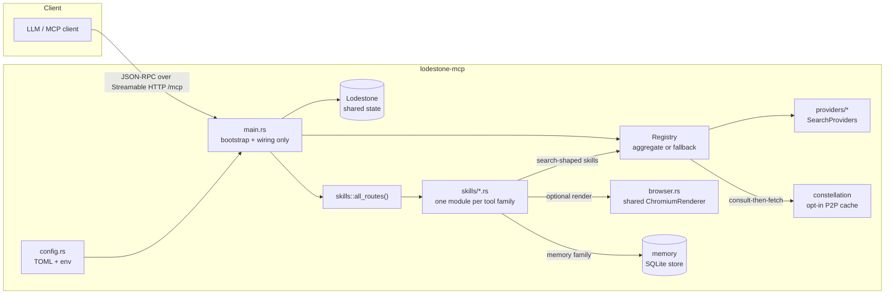
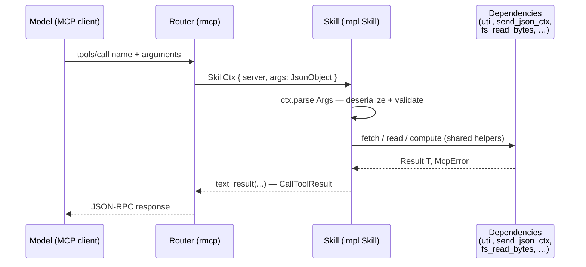
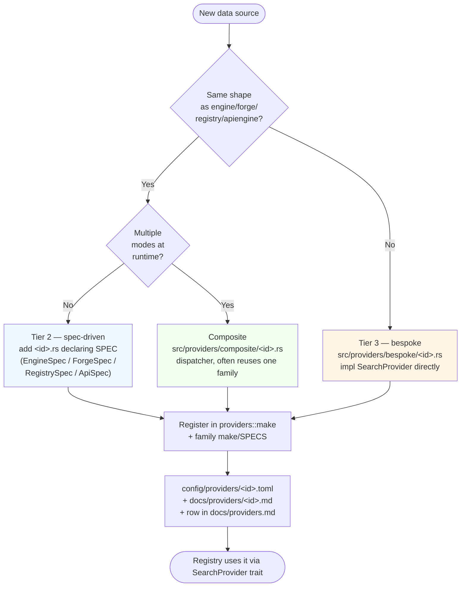
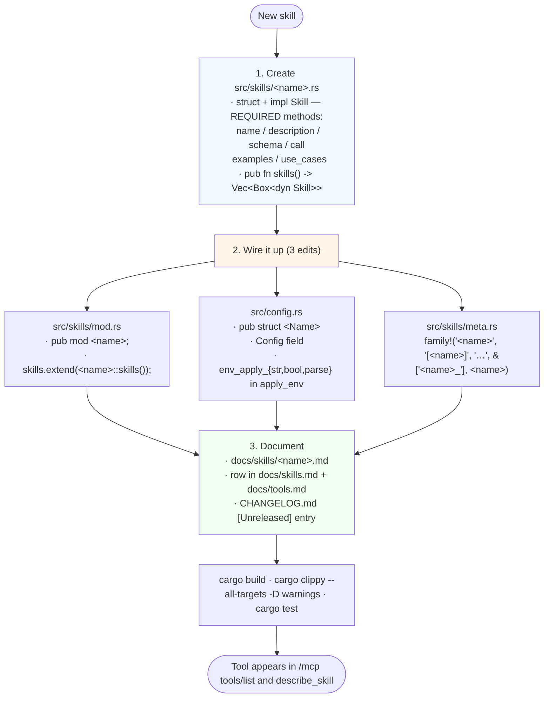
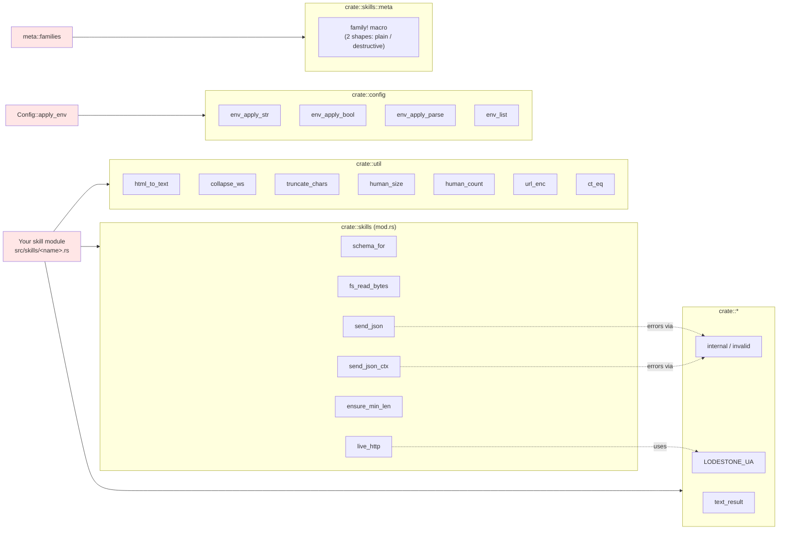

# Contributing to lodestone-mcp

This guide explains how the codebase is laid out, the few invariants that keep it
correct, and how to extend it (the common case: adding a search provider).

## Golden rules (non-negotiable)

The project invariants are maintained in one place — read them there:
**[docs/golden-rules.md](docs/golden-rules.md)**. New code, new providers,
and behaviour changes to existing skills must uphold every rule in that
document; a change that breaks one is wrong by definition. This guide
does not restate them — the golden-rules file is the single source of
truth, and summarizing it here just creates two versions to keep in
sync.

## Architecture at a glance



Two truths in that picture: every tool the model invokes is a skill module
(golden rule 7 — `main.rs` is wiring only), and providers are *data sources for
the search skills*, not themselves tools (terminology section below).

```
src/
  main.rs        Bootstrap + wiring ONLY (golden rule 7). Loads config, builds the
                 Registry + shared state (Lodestone), configures the renderer and
                 forge sites, assembles the router from skills, serves
                 Streamable-HTTP at /mcp. No tool logic lives here.
  skills/         Every tool, one module per skill family, implementing the
                 `Skill` contract (name/description/schema/call); mod.rs assembles
                 them into routes and computes config gating (disabled_by_config).
                 A skill owns its domain logic + arg structs + formatters.
                 ~100 family modules covering:
                 - Search / retrieval / archive / RFC / standards / arxiv /
                   pubmed / openaccess / huggingface / wikipedia / news / kernel
                   / github.
                 - Containers & cloud-native: oci, artifacthub, docker (daemon),
                   kubernetes.
                 - Local-system: filesystem, shell, git, sysinfo, databases,
                   store, packages.
                 - Devices: serial, printer, sdr, mqtt, meshtastic, systemd.
                 - Runtimes: python, ffmpeg, spreadsheet.
                 - Binary / signal / pcap / notebook / disasm / wave / image /
                   html / chart / new_charts / browser_session.
                 - Astronomy / earth: astro, satellite, earth_models, radio,
                   atmospheric, nasa, weather, noaa, osm, grid, peeringdb, fcc.
                 - **Math & science suite (0.1.2)**: linalg, quaternion, ode,
                   geodesy, info_theory, crypto_math, rf_link, radar,
                   dsp_advanced, tracking, acoustic, nav_aiding, trajectory,
                   optimization, open_data, geo_convert, interchange.
                 - Utilities: datetime, translate, data, regex, formula,
                   arithmetic, algebra, geometry, trigonometry, physics, units,
                   finance, stocks, yahoo, forecast.
                 - Infrastructure / introspection: memory, tasks, mcp_tasks,
                   meta, eia.
                 Plus guard: the shared confirmation gate for destructive
                 actions (confirm-token flow; client-agnostic, no elicitation
                 needed). The on-disk file store itself lives in src/store.rs.
  provider.rs    The core interface: SearchProvider trait, ProviderKind,
                 Strategy, SearchQuery, SearchResult, and the Registry that
                 combines providers (fallback chain or aggregate meta-search).
  providers/      Providers, grouped by family (one subfolder per family).
    mod.rs       Provider factory `make()` + shared helpers (scoped queries,
                 result zipping, `finish`, the configurable code-site list).
    engine/      Spec-driven search engines (HtmlEngineProvider + EngineSpec):
                 duckduckgo, mojeek, google.
    apiengine/   Spec-driven KEYED JSON web-search APIs (ApiProvider + ApiSpec),
                 off unless a key is set: brave, google_cse.
    forge/       Spec-driven code forges (ForgeCodeProvider + ForgeSpec, and the
                 shared `forge::search`): gitlab, codeberg, gitea.
    registry/    Spec-driven doc/package registries (RegistryProvider +
                 RegistrySpec, JSON APIs, `docs` kind): cratesio, npm, mdn.
    composite/   Multi-mode providers that dispatch (and reuse a family):
                 github (scrape↔API), stackexchange (API↔render).
    bespoke/     Unique transport/parse providers: grep_app (JSON), medium (RSS),
                 searxng (self-hosted metasearch JSON, web+code).
  browser.rs     PageRenderer trait + a persistent, process-shared
                 ChromiumRenderer. Any provider can render on demand.
  config.rs      Config struct + file (TOML) and env-var loading.
  cache.rs       In-memory TTL cache used by the Registry for search results.
  constellation/          Opt-in P2P constellation: Bloom-filter digests, consult-then-fetch
                 with consensus/reputation anti-poisoning, mDNS + gossip
                 discovery, bounded relay across the mesh graph.
  galaxy/        Opt-in rendezvous broker that links constellations across
                 networks (a directory of public ingress endpoints; not a
                 proxy). Serve a broker and/or register+pull as a participant.
  util.rs        HTML→text, whitespace/entity helpers, truncation.
```

## Core concepts

### Terminology: provider vs. skill vs. tool

These three words are used precisely throughout the codebase:

- **Tool** — the MCP wire primitive the model invokes: a `name`, a JSON argument
  schema, and a handler. "Tool" is the protocol-level concept (what shows up in
  `tools/list`).
- **Skill** — *our* abstraction that **implements** a tool: a self-contained module
  under [`src/skills/`](src/skills/) implementing the [`Skill`](src/skills/mod.rs)
  contract (`name` / `description` / `schema` / `call`) and owning its domain logic.
  Every skill produces exactly one tool. This is the unit you add when you add a
  capability (golden rule 7) — never inline in `main.rs`.
- **Provider** — a *data source* implementing
  [`SearchProvider`](src/provider.rs) under [`src/providers/`](src/providers/)
  (kinds: web/code/qa/docs), selected per kind and combined by a strategy. A
  provider is **not** itself a tool; it's surfaced through the search skills
  (`web_search`, …) and an auto-generated per-provider tool `<kind>_<id>`
  (e.g. `code_github`). Skills may build on providers; many skills (translate,
  docker, kubernetes, …) have no provider at all.

So: *providers* are sources of ranked results; *skills* are the modular
capabilities that become *tools*. Search skills consume providers; non-search
skills (e.g. the Docker/Kubernetes/translate families) talk to their own clients.

### Providers vs. retrieval

- A **provider** (`providers/`) ranks many candidates for a query and implements
  `SearchProvider`. Providers are pluggable and config-selected.
- **Retrieval** fetches one specific, already-identified thing (a file, a page, a
  Q&A thread). It is not a provider — the logic lives *with its skill* under
  `skills/` (e.g. the raw-file/page/PDF/Wayback primitives in
  [`skills/retrieve.rs`](src/skills/retrieve.rs); GitHub helpers in
  [`skills/github.rs`](src/skills/github.rs)).

### Anatomy of a tool call



The skill never sees the wire protocol — `SkillCtx` already carries the
deserialized argument object and a shared `Lodestone` handle (HTTP client,
caches, config). Errors flow back via `McpError`; use `crate::internal(...)`
for transport/parse failures and `crate::invalid(...)` for bad arguments.

### The provider interface

```rust
#[async_trait]
pub trait SearchProvider: Send + Sync {
    fn id(&self) -> &'static str;                // config id / attribution
    fn kind(&self) -> ProviderKind;              // Web | Code | Qa
    async fn search(&self, http: &Client, query: &SearchQuery)
        -> anyhow::Result<Vec<SearchResult>>;
}
```

- Return an **empty vec** for "no results" (the registry moves on).
- Return **`Err`** for transport/parse failures (logged as a warning, skipped).
- The `Registry` runs providers per `ProviderKind` using the configured
  `Strategy`: `Fallback` (first non-empty wins) or `Aggregate` (run all, dedupe
  by URL, re-rank, annotate engines). The re-ranking methods (default
  `composite`) are documented in [docs/ranking.md](docs/ranking.md).

### Rendering is shared and model-controlled

`browser.rs` exposes a `PageRenderer` trait and a process-wide `ChromiumRenderer`
via `browser::shared_global()` (always compiled in; a Chrome binary is only
needed at runtime when a render path actually runs). The `SearchQuery::render`
flag (set per call by the model on the search tools) and the dedicated
`render_page` tool let any HTML-scraping path fetch through the headless browser
instead of plain HTTP. The `engine` family honors the flag automatically;
bespoke providers that scrape HTML branch on `query.render` and call
`crate::browser::shared_global().render(url)` themselves (see `stackexchange.rs`).

## What kinds of features fit (and what don't)

Before opening a PR or an issue with a proposal, run the idea past the golden
rules. Most rejections trace back to the same handful of mismatches, and most
good fits trace back to the same handful of patterns. Use the table below as a
litmus test; if your idea doesn't appear, the matching golden rule is your
oracle.

### New skill (= new tool family)

| ✅ Fits | ❌ Doesn't fit | Why |
| --- | --- | --- |
| `tide_charts { lat, lon, date? }` — NOAA Tides & Currents (keyless). | `ai_summarize_page { url }` — wraps another LLM to summarize. | Rule 2 (the LLM decides): the host model already summarizes; smuggling in another model takes the decision away from the user's model. Use `fetch_page` and let the host decide what to do with the text. |
| `dns_lookup { name, type? }` — system resolver, deterministic, no network beyond the query. | `email_send { to, subject, body }` — SMTP/SES write. | Rule 8 (destructive never unguarded). A one-shot send-and-forget can't be undone; if you really need it, route through the [`guard`](src/skills/guard.rs) and keep it `[email].enabled = false` by default. |
| `decode_jwt { token }` — pure-local parse into header + payload. | `crypto_wallet_balance { address }` — third-party paid API, or worse, a hot-wallet read. | Rule 3 (keyless by default); also broadly out of scope. The wallet-balance use case wants a different project (or a `web_search` against the public block explorer). |
| `sat_passes { tle, observer }` — split out from a pre-existing `satellite_compute` tool that took a `mode` arg. | `satellite_compute { mode: "pass" \| "position" \| "look" }` — one tool, mode-switched. | Rule 9 (one tool per method). The method belongs in the name; `sat_passes` / `sat_position` / `sat_observe` is what we shipped. |
| `image_thumbnail_extract { path }` — pure-Rust EXIF thumbnail walk, paths confined to `[filesystem].roots`. | `image_recognize { path }` — runs a remote ML model. | Rule 3 (keyless) and Rule 7 (skill domain logic lives in its module). Remote ML is someone else's project; the host model can call it from its own toolkit. |
| `physical_constant { name? }` — bare lookup, ~50 SI constants compiled in. | `auto_buy_stocks { ticker, qty }` — placing real trades. | Wrong project, rule 8, also rule 5 (every capability ships with an off switch — there's no off switch for "I bought $5k of NVDA"). |
| `nuke_q_value` — atomic-mass reaction Q with the CODATA 2022 u↔MeV factor cited inline, vendored AME2020 atomic-mass subset, test pinning D+T → ⁴He+n at 17.589 MeV. | `radio_signal_strength { ssid }` — returns a number with no cited reference for the propagation model, no test, no honest caveat about indoor multipath. | Rule 12 (cite the source, ship a test reproducing a known-correct result). A tool that quotes a constant without naming the source — or a formula without naming the paper — produces *plausibly* wrong output that the model will defend. |

### New search / data provider

| ✅ Fits | ❌ Doesn't fit | Why |
| --- | --- | --- |
| `web_kagi_open` — keyless Kagi endpoint if one exists. | `web_kagi` — full paid Kagi API as a **default**. | Rule 3: keyed providers are off until a key is set and never replace keyless. A keyed Kagi provider is fine; making it default isn't. |
| `code_framagit` — Gitea-shaped, site-scoped DuckDuckGo+Mojeek search of `framagit.org`. Tier-2 spec entry. | `code_smart` — auto-routes between GitHub / GitLab / forge based on the query. | Rule 9 (no hidden auto-selection). The model picks the tool. The user wants `code_github`, they call `code_github`. |
| Adding `pkg.go.dev` to `registry/` — new file declaring a `RegistrySpec`, joins `docs_search`. | A provider that needs a per-user cookie or a hidden API. | Rule 3 + rule 6 (keyless + documented). A cookie isn't keyless and probably violates the upstream's ToS. |
| A new `apiengine/` member when the user supplies a key (off by default). | Logging the user's queries to a third-party analytics service. | Rule 11 (sensitive info never shared). Query text crossing the wire to a third party is a leak vector. The constellation already shares only hashes for a reason. |

### Cross-cutting / infrastructure

| ✅ Fits | ❌ Doesn't fit | Why |
| --- | --- | --- |
| `chart_violin` — new SVG shape via `PlotArea`, pure-Rust deterministic. | Server-side rasterization of charts via a headless browser when SVG would do. | Rule 1 (scrape default, render fallback). The browser is for fetching pages, not painting our own output. SVG is responsive and doesn't need a renderer. |
| A new `Source` variant for `Pubmed` with a sensible TTL + min_agreement floor. | Always-on telemetry to a metrics service. | Rule 5 (everything is enable/disable-able) and rule 11. If you want metrics, expose them via a local `/metrics` endpoint behind `[network].token` and let the operator scrape it. |
| `constellation_status` enhancements — more reputation detail, prune-history, live-blob counts. | A "phone home on first boot" registration with a public directory. | Rule 5 + rule 11. The galaxy broker is opt-in and explicit; surprise outbound traffic isn't. |
| A new `--dry-run` flag on a destructive skill (alongside `confirm`/`trust`). | Removing the `guard` from a destructive skill because "the user already confirmed in chat". | Rule 8 explicitly: the guard is client-agnostic by design. The chat client isn't the source of truth; the protocol is. |

### Behaviour change to an existing skill

| ✅ Fits | ❌ Doesn't fit | Why |
| --- | --- | --- |
| `wayback_fetch` attaches the raw URL + snapshot URL as cache aliases so peers asking by raw URL also hit the entry (what we shipped). | `wayback_fetch` automatically tries `web.archive.org` if the original URL 404s on the live web, without the model asking. | Rule 2. The model didn't ask for an archive lookup; it asked for the page. Surfacing the option in the description is fine; auto-redirecting isn't. |
| `osm_overpass` keys by QL hash so cross-skill cache hits (what we shipped). | `osm_overpass` rewrites the user's QL to "improve" it. | Rule 9 + rule 2. The QL is the method. If we rewrite, we hide what actually ran. |
| `read_pdf` honours `max_chars` more strictly so the cache entry shape matches the requested chars. | `read_pdf` runs a local LLM to summarize after extraction. | Rule 2 + scope creep. The host model summarizes. |
| Adding `--state` / `--pattern` to `systemd_list`. | Auto-restarting failed units that `systemd_status` happens to show. | Rule 8. A read tool that performs writes is the worst kind of guard bypass. |

### A quick litmus heuristic

A proposal almost always fits if it's:

- **Local-or-keyless**, **deterministic** (same input → same output once cached),
  **read-shaped** OR explicitly destructive with the guard wired up, and
  **one method per tool**;

and almost always doesn't fit if it:

- requires a paid account on the **default** path,
- decides for the model (auto-routes, auto-fallbacks, auto-summarizes),
- can't be turned off, or
- moves data the user didn't deliberately ask to move (telemetry, phone-home,
  query text crossing to a third party).

When in doubt, propose it in an issue first with which golden rule(s) you
think it touches and how. The conversation is faster there than after the PR.

## The provider paradigm

> For a detailed, per-provider reference (what each one does, keyless vs.
> credentialed, config, caveats), see [docs/providers.md](docs/providers.md).
> This section is about the *architecture*; that page is about the *providers*.

Sources fall into three tiers, from most-shared to most-specific. **Prefer the
highest tier that fits:** push everything generic into shared code and keep only
the genuinely-unique bits in per-source files.

**Tier 1 — the universal interface (`provider.rs`).**
Every source, however implemented, is a `SearchProvider`: `id()`, `kind()`,
`async search(...) -> Vec<SearchResult>`. The `Registry` only ever sees this
trait — it has no idea whether a provider scrapes HTML, calls a JSON API, or
reads RSS. This is what lets providers be combined uniformly (fallback chain or
aggregate meta-search) and selected from config.

**Tier 2 — spec-driven families (a shared provider + a declarative spec).**
When several sources share the SAME logic and differ only in *data*, model the
logic ONCE as a provider parameterized by a small declarative spec, and make each
source a tiny file that just declares its spec:

| Family (dir) | Shared provider | Declarative spec | Members (one file each) |
| --- | --- | --- | --- |
| `engine/` (web search) | `HtmlEngineProvider` | `EngineSpec` — url, `Method` (GET/POST/Browser), `Extract` (two CSS selectors *or* a custom fn), code-scope, extra params | duckduckgo, mojeek, google |
| `forge/` (code forges) | `ForgeCodeProvider` / `forge::search` | `ForgeSpec` — id, domain, blob-URL → `(repo, path)` parser | gitlab, codeberg, gitea (GitHub reuses `forge::search` — see below) |
| `registry/` (doc/package registries, `docs` kind) | `RegistryProvider` | `RegistrySpec` — url, query/size params, results JSON pointer, item map (name/description/url field-or-template/version pointers) | cratesio, npm, mdn, … |
| `apiengine/` (keyed web search, `web` kind) | `ApiProvider` | `ApiSpec` — url, query/size params, `Auth` (key as header or query param), results pointer, title/link/snippet pointers | brave, google_cse (off unless keyed) |

Google is an engine too — it just declares `Method::Browser` (always render via
headless Chrome) and an `Extract::Custom` parser for its messy markup, instead
of plain GET + two selectors. A future Bing engine would look the same.

Families also **compose**: `ForgeCodeProvider` runs its searches *through* the
`engine` family (DuckDuckGo → Mojeek). Adding a member is a few declarative lines
— no new control flow, no risk to the existing members.

**Tier 3 — bespoke providers (implement the trait directly).**
When a source's transport or parsing is genuinely unique, write a normal
`SearchProvider` in its own file. These don't fit a spec because their wire
formats differ: `grep_app` (JSON code API), `medium` (tag RSS/XML), `searxng`
(self-hosted metasearch JSON, serving web+code). Forcing them into a shared spec
would just turn the spec into a bag of callbacks, so they stay bespoke.

**Composite providers.** Some sources have more than one mode and pick one at
runtime — these are bespoke shells that *dispatch* (and often reuse a family for
one mode), honoring the golden rules:

- `github` — **scrape by default** (reuses `forge::search` with a github
  `ForgeSpec`); switches to the authenticated GitHub **API** only when a token is
  set. GitHub's keyless half is a forge; its API half isn't, so the whole thing
  is composite rather than a plain forge member.
- `stackexchange` — keyless **API** by default; scrapes via the headless browser
  only when the caller sets `render=true`.

**Decision rule:** is this source the *same shape* as an existing family — an
HTML search engine, or a code forge? If yes, add a spec (tier 2). If its
transport/parsing is unique, add a bespoke provider (tier 3). Either way it
becomes a `SearchProvider` the registry treats identically (tier 1).



### Adding a web engine (tier 2)

1. Create `src/providers/engine/<name>.rs` with `pub(super) static SPEC: EngineSpec`
   — endpoint URL, a `Method` (`Get`/`PostForm`, or `Browser` to always render),
   an `Extract` (two CSS selectors, or a `Custom` parser fn for messy markup), a
   `CodeScope` (`SiteOperator` if it supports `site:`, else `Keyword`), and any
   fixed `extra_params`.
2. Add `mod <name>;` and a `make()` arm in `providers/engine/mod.rs`.
3. Add the id to the `engine` arm in `providers::make()`, a
   `config/providers/<name>.toml`, and the `02-search.toml`/README lists.

### Adding a code forge (tier 2)

1. Create `src/providers/forge/<name>.rs` with `pub(super) static SPEC: ForgeSpec`
   (`id`, `domain`, and a `fn(&str) -> Option<(repo, path)>` blob-URL parser).
2. Add `mod <name>;`, a `make()` arm, and the spec to `SPECS` in
   `providers/forge/mod.rs`.
3. Register the id in `providers::make()` and add `config/providers/<name>.toml`.

### Adding a bespoke provider (tier 3)

1. Create `src/providers/bespoke/<name>.rs` implementing `SearchProvider`. Do all
   `.await` first to get owned data, then parse **synchronously** (see the
   invariant below). For HTML scraping, honor `query.render` via
   `browser::shared_global()`.
2. In `bespoke/mod.rs` add `mod <name>;` and `pub(crate) use <name>::<Type>;`,
   then add a `make()` arm in `providers/mod.rs`; run code results through
   `super::finish(...)` for forge filtering/enrichment.
3. Add `config/providers/<name>.toml` and document the id.

A **composite** provider (one that dispatches between modes, like `github` or
`stackexchange`) goes in `src/providers/composite/` the same way — and may reuse
a family (e.g. `crate::providers::forge::search`) for one of its modes.

## Provider contribution checklist

A provider isn't done when it compiles — it's done when an **end user can clone,
run, and understand it without reading the source**. Every new provider PR must
tick all of these:

- [ ] **Resolves by id.** Registered in `providers::make()` (and the family
      `make()`/`SPECS` if spec-driven) so `<id>` works in `config/02-search.toml`.
- [ ] **Config file** `config/providers/<id>.toml` that:
      - documents **every** property it offers — purpose, accepted values/format
        (with examples), default, and the matching `LODESTONE_*` env var; and
      - ships **sane keyless defaults that work out of the box** (or, if the
        provider has no tunables, a short doc-only file saying what it does and
        how to enable it).
- [ ] **Listed in `config/02-search.toml`** under the known ids for its kind.
      Add it to a default `[providers]` list only if it's keyless and reliable
      with zero setup; otherwise document it as opt-in.
- [ ] **Per-provider doc page** `docs/providers/<id>.md` (copy an existing one as
      a template): the header table (family, kind(s), default-on, keyless, render,
      code link, config link), **Why**, **Features**, any **Caveats**, **Skills
      (tools)** (the general tool it joins + its `<kind>_<id>` tool), and
      **Schema / structs** (the spec/struct literal and config keys).
- [ ] **Index row in [docs/providers.md](docs/providers.md)** under its family,
      linking to the new page.
- [ ] **Reference docs updated** — [docs/tools.md](docs/tools.md) (its `<kind>_<id>`
      tool / any bespoke skill) and, for a new family, a row/section in the relevant
      reference. The README is a concise overview; it links to these, so it usually
      needs no per-provider edit.
- [ ] **All [golden rules](docs/golden-rules.md) upheld** — in particular keyless
      by default, scrape-default / render-optional, enable/disable-able, and
      documented.
- [ ] **Stable, snake_case `id`** — it becomes the auto-generated per-provider
      tool name `<kind>_<id>` (e.g. `code_<id>`), so pick it deliberately.
- [ ] **A fixture-based parse test** where practical (pin the scraper/parser).
- [ ] **Credentials, if any:** read from config *and* a `LODESTONE_*` env var,
      never logged, never committed (the live `lodestone.toml` is gitignored).

## Invariants & conventions

- **Never hold a `scraper` value across `.await`.** `Html`, `Selector`, and
  `ElementRef` are `!Send`; the tool futures must be `Send`. Do all awaits first
  to obtain an owned `String`, then parse in a **synchronous** function that
  returns owned data. (This is why every provider has a `fn parse(...)`.)
- **Errors:** providers/retrieval return `anyhow::Result`; the tool layer in
  `main.rs` maps them with `internal()` / `invalid()` to MCP errors.
- **Keyless ethos:** don't introduce a source that requires a key/account unless
  it's optional, documented, and has a keyless fallback. Never log secrets.
- **No secrets in git:** `lodestone.toml` is gitignored; commit changes to
  the committed `config/` baseline / `examples/` instead. Prefer `GITHUB_TOKEN`
  via env over any file.
- Keep comments about *why*, not *what*; let names carry the rest.

## Build & verify

> **Golden rule 10:** `cargo fmt` and `cargo clippy --all-targets -- -D warnings`
> are non-negotiable. Both must pass before every commit; CI enforces both.

There are no Cargo features — the headless browser (`chromiumoxide`) is always
compiled in; a Chrome/Chromium binary is only needed at runtime when a render or
Google path actually runs.

### The pre-commit triad

Run these **in order**, every time, before `git commit`:

```sh
cargo fmt --all                              # 1. Format the whole workspace.
cargo build                                  # 2. Check it compiles.
cargo clippy --all-targets -- -D warnings    # 3. Lint at deny-warnings.
cargo test                                   # 4. (Recommended) Hermetic tests.
```

There's a [`Makefile`](Makefile) that wraps these. `make check` runs the four
steps in order and prints a green check on success; `make ci` runs exactly
what CI runs (with `fmt --check` instead of `fmt`, so it fails on unformatted
code rather than silently fixing it). `make` with no target prints the
self-documenting help with every available target — `make help`. On Windows,
run it from Git Bash or WSL, or invoke the cargo commands directly from
PowerShell.

If any of these fails, **fix the underlying problem**. Never `--no-verify` past
a failing check (golden rules say so explicitly), never silence a clippy lint
with a blanket `#[allow]` without understanding what it caught, never let an
"I'll clean it up later" diff land. Local enforcement is fast; CI enforcement is
slow and visible to everyone.

### Why each step matters

**`cargo fmt --all`** — the Rust standard formatter ([`rustfmt`][rustfmt]).
The repo uses upstream defaults (no `rustfmt.toml` overrides), so any rustup
toolchain produces identical output; `--all` covers every member of the
workspace, not just the current crate. Reformatting is purely textual — it
never changes semantics — so running it can't break anything. Why bother? Two
reasons:

1. **Diffs become semantic.** When everyone formats identically, `git diff` and
   `git blame` show meaning changes instead of whitespace churn. Reviewers
   spend their attention on what changed, not how it's indented.
2. **CI fails on it.** A push that doesn't pass `cargo fmt --check` is
   immediately rejected — running fmt locally turns a 5-minute CI round-trip
   into a 0.5-second `fmt` round-trip. (CI uses `cargo fmt --all --check`,
   which exits non-zero on any change rather than rewriting files.)

If you're already inside an edit and `cargo fmt` rewrites whitespace, that's
fine — the diff stays clean because the rest of the repo is already formatted.

**`cargo build`** — basic compile gate. Run this before clippy so any borrow-
checker or type error surfaces with the faster error path, not buried under
clippy lint output. Catches missed imports, broken generic bounds, missing
`mod` declarations after adding a new skill file.

**`cargo clippy --all-targets -- -D warnings`** — the Rust linter
([`clippy`][clippy]) at deny-on-warning. Decomposed:

- `clippy` runs ~600 lints — correctness, performance, idiom, style, perf,
  pedantic — over the AST + HIR. The default set is correctness-leaning;
  anything it flags is at minimum "this is a code smell," at maximum "this is
  a latent bug."
- `--all-targets` runs against the binary **and** every `#[test]`,
  `#[cfg(test)]` module, example, and benchmark. Without it, test-only code
  rots — a clippy regression in a `#[test]` block doesn't show up in
  `cargo clippy` alone.
- `-- -D warnings` (the `--` separates clippy args from rustc args) promotes
  every warning to an error. Without this, clippy *prints* the warning but
  exits 0; CI would happily ship code with dozens of unaddressed lints. With
  it, clippy is a hard gate.

**Why deny-warnings instead of "just check it manually"?** Warnings rot. A
project that accepts "0 errors, 47 warnings" gradually accumulates lint debt
until nobody can tell whether a new warning is real or noise. Deny-warnings
means every clippy ping must be either fixed or explicitly silenced with a
narrow `#[allow(specific::lint)]` + reason comment — at which point the
silence is documented, reviewable, and removable later.

**`cargo test`** — runs the hermetic test suite (parser fixtures, config-merge
tests, math, etc.). `#[ignore]` tests are skipped — those are the `mod live`
network-touching ones, which contributors run manually before shipping a
provider change but CI doesn't run on every push. The full suite finishes in
under a second on a modern laptop.

### Common pitfalls

- **"clippy passes locally but fails in CI"** — almost always means you ran
  `cargo clippy` without `--all-targets`. The fix is to always include it.
- **A new `#[allow(clippy::xxx)]` with no rationale comment** — write *why*
  the lint is wrong for that site. Future maintainers (including you in three
  months) need to know whether the lint can be re-enabled.
- **`unwrap()` / `expect()` / `panic!` in an async path** — clippy will catch
  many of these, but not all. In a tool handler, propagate errors via
  `Result<…, McpError>` and the `internal()` / `invalid()` helpers (see the
  "Anatomy of a tool call" diagram earlier); panicking takes down the whole
  server.
- **Hand-rolled helper instead of the shared one** — clippy won't catch this;
  reviewers will. Skim the "Shared helpers" section above before writing
  another `fn url_encode(...)`.

### Editor / pre-commit integration

You can shift the entire triad into the background:

- **Editor on save.**
  - **rust-analyzer** ([`rust-analyzer.github.io`][rust-analyzer], the standard
    LSP) — set `"rust-analyzer.check.command": "clippy"` and
    `"rust-analyzer.check.extraArgs": ["--all-targets", "--", "-D", "warnings"]`
    to surface clippy lints inline as you type, in the same format CI sees.
    Pair with the standard format-on-save action for `cargo fmt`.
  - **JetBrains RustRover / IntelliJ Rust** — *Settings → Languages & Frameworks →
    Rust → External Linters → Clippy*, with the same args (`--all-targets`,
    `-- -D warnings`). Format-on-save under *Tools → Actions on Save → Reformat
    code*.
  - **`cargo-watch`** ([`cargo-watch`][cargo-watch]) — for a terminal-driven
    loop: `cargo install cargo-watch`, then
    `cargo watch -x 'fmt --all' -x 'clippy --all-targets -- -D warnings' -x test`.
- **Pre-commit hook.** `make install-hooks` drops a one-line wrapper
  (`exec make ci`) into `.git/hooks/pre-commit` so a `git commit` that would
  fail CI never lands. Or drop your own version in — a minimal one is:

  ```sh
  #!/bin/sh
  set -e
  cargo fmt --all -- --check    # --check fails if anything needs reformatting
  cargo clippy --all-targets -- -D warnings
  cargo test
  ```

  Mark it executable (`chmod +x .git/hooks/pre-commit`). For workspace-wide
  enforcement, [`pre-commit`][pre-commit] (the Python framework) has Rust
  hooks too.

### Useful links

- **rustfmt** — [`github.com/rust-lang/rustfmt`][rustfmt]. Stable formatter
  shipped with every rustup toolchain (`rustup component add rustfmt` if
  missing).
- **clippy** — [`github.com/rust-lang/rust-clippy`][clippy]. The
  [lint index][clippy-lints] is a searchable reference for every lint name,
  category, and what it's looking for.
- **rust-analyzer** — [`rust-analyzer.github.io`][rust-analyzer]. The LSP
  every modern editor uses; the [manual][rust-analyzer-manual] documents
  every editor-side setting.
- **cargo-watch** — [`github.com/watchexec/cargo-watch`][cargo-watch].
- **pre-commit** — [`pre-commit.com`][pre-commit].

[rustfmt]: https://github.com/rust-lang/rustfmt
[clippy]: https://github.com/rust-lang/rust-clippy
[clippy-lints]: https://rust-lang.github.io/rust-clippy/master/index.html
[rust-analyzer]: https://rust-analyzer.github.io/
[rust-analyzer-manual]: https://rust-analyzer.github.io/manual.html
[cargo-watch]: https://github.com/watchexec/cargo-watch
[pre-commit]: https://pre-commit.com/

## Adding a skill (= adding a tool)

> **Golden rule 7:** every tool is a self-contained skill module — no tool logic
> in `main.rs`. The flow below is the one path; there is no shortcut for "small"
> tools.

A new skill is one module under [`src/skills/`](src/skills/) plus three wiring
touches. Each tool the skill exposes is a struct that implements the
[`Skill`](src/skills/mod.rs) contract.



> **The Skill contract has six methods, not four.** `name`, `description`,
> `schema`, and `call` are the runtime path; `examples` and `use_cases` are
> the LLM-orientation path consumed by `describe_skill` and the dynamic
> handshake. Both are now expected for every new skill (coverage is at 432
> of 466 as of 0.1.10). The detailed contract and self-check checklist
> live in [§"Worked examples and use cases"](#worked-examples-and-use-cases)
> below; the skeleton in step 1 includes them up-front so you don't bolt
> them on as an afterthought.

### 1. Write the module

`src/skills/<name>.rs`:

```rust
use std::sync::Arc;

use futures::future::BoxFuture;
use rmcp::model::{CallToolResult, JsonObject};
use rmcp::ErrorData as McpError;
use serde::Deserialize;

use crate::skills::{schema_for, Skill, SkillCtx};
use crate::{invalid, text_result};

#[derive(Debug, Deserialize, schemars::JsonSchema)]
struct DoThingArgs {
    /// Rustdoc on each field becomes its JSON-schema description, which the
    /// model reads. Be specific — this is the only signal it has.
    target: String,
}

pub struct DoThing;
impl Skill for DoThing {
    fn name(&self) -> &'static str { "<name>_<verb>" }
    fn description(&self) -> &'static str {
        "One-line tool description shown to the model. State what it does, what \
         it returns, and any non-obvious default."
    }
    fn schema(&self) -> Arc<JsonObject> { schema_for::<DoThingArgs>() }
    fn call<'a>(&self, ctx: SkillCtx<'a>) -> BoxFuture<'a, Result<CallToolResult, McpError>> {
        Box::pin(async move {
            let (server, args) = ctx.parse::<DoThingArgs>()?;
            // … domain logic — use the shared helpers in §"Shared helpers" below
            //   instead of rolling your own HTTP, percent-encoding, file-read,
            //   or env-var-merge code …
            Ok(text_result(format!("ran on {}", args.target)))
        })
    }

    // examples() and use_cases() are expected for every new skill — the
    // LLM-orientation path consumed by `describe_skill` and the dynamic
    // handshake. See §"Worked examples and use cases" below for the
    // contract + a self-check checklist drawn from real bugs the
    // catalog-fill verifier caught.
    fn examples(&self) -> &'static [crate::skills::SkillExample] {
        use crate::skills::SkillExample;
        &[
            SkillExample {
                title: "Canonical minimal invocation",
                args: r#"{"target": "example"}"#,
                note: Some("Returns `ran on example`."),
            },
            // 1–3 more examples that each demonstrate something different.
        ]
    }
    fn use_cases(&self) -> &'static [&'static str] {
        &[
            "When to reach for THIS tool over a sibling (e.g. `web_search` vs `code_search`).",
            "A second situation, framed as a one-liner.",
        ]
    }
}
```

> **Where `description()` actually goes**: this string is **piped straight into
> the MCP `tools/list` response** at `src/skills/mod.rs::route` — it's the
> primary signal the LLM uses to pick which tool to call. Write it as
> model-facing copy: concise, specific, mentions inputs / outputs / limits, and
> matches the schema's field docs. The dashboard's Tools page also renders it
> below each tool name; the same string serves both audiences.

```rust
// (rest of the module)

/// Every skill module exposes one `skills()` function returning its skills as
/// boxed trait objects. `mod.rs::all_skills()` extends from each.
pub fn skills() -> Vec<Box<dyn Skill>> {
    vec![Box::new(DoThing)]
}
```

### 2. Wire it up

Three small edits, all mechanical:

| File | Edit |
| --- | --- |
| `src/skills/mod.rs` | Add `pub mod <name>;` to the module list, then `skills.extend(<name>::skills());` in `all_skills()`. |
| `src/config.rs` | Add a `pub struct <Name> { pub enabled: bool, … }` (mirror an existing one — `pub use ToggleOnly as <Name>` for the on/off case), wire a field into `Config`, and one line per setting in `apply_env()` via `env_apply_{str,bool,parse}` (§"Shared helpers"). |
| `src/skills/meta.rs` | Add a one-line entry inside `families()`. For the plain on/off case use `family!("<name>", "[<name>]", "Description", &["<name>_"], <name>)`; for the destructive-confirm case append `, destructive`. Skills with bespoke knobs keep a long-form `Family { … }` literal. |

### 3. Document it

- `docs/skills/<name>.md` (copy an existing one as a template).
- Row in [`docs/skills.md`](docs/skills.md) and [`docs/tools.md`](docs/tools.md).
- An entry under "Added" in [`CHANGELOG.md`](CHANGELOG.md)'s `[Unreleased]`.
- For destructive tools: see [golden rule 8](docs/golden-rules.md).
- For factual / mathematical skills: see [golden rule
  12](docs/golden-rules.md). The 0.1.4 / 0.1.5 modules (`chemistry`,
  `biology`, `nuclear`, `radiology`, `machinist`, `cnc`) are the reference
  pattern; the running validation ledger is
  [`docs/audit-report.md`](docs/audit-report.md).
- For skills that pull a stable remote artifact (papers, reference data,
  scientific feeds): override
  `Skill::retrieval_policy()` so the tool's cache & constellation
  participation is *declared by type*, not just hand-rolled in the call
  body. Three variants in
  [`src/skills/mod.rs`](src/skills/mod.rs)::`RetrievalPolicy`:
  - `RetrievalPolicy::None` (default) — pure-compute tools or tools whose
    output isn't a stable artifact. No caching, no peer participation.
  - `RetrievalPolicy::LocalOnly` — cache locally for this node's repeated
    queries but **do not** advertise to the constellation. Use when the
    response body came from a **keyed** or licensed source whose payload
    must not cross to peers ([golden rule 11](docs/golden-rules.md)).
  - `RetrievalPolicy::Shared { source }` — cache locally **and** advertise
    over the constellation digest under the canonical key + aliases. Use
    for **keyless** academic / scientific retrieval (papers, NCBI, RFC,
    standards, UniProt, PDB, Ensembl, NASA, NOAA, USGS, SWPC,
    OpenSky, …). The `Source` (`Arxiv`, `Github`, `Wayback`, `Overpass`,
    `SearchEngine`, `Other`) drives per-source TTL and the consensus floor
    for trusting peer-served bytes — see
    [`src/constellation/identifiers.rs`](src/constellation/identifiers.rs).

  Examples for each policy:

  ```rust
  // Pure-compute math / chemistry / engineering — no caching, no sharing.
  // Default: do not override unless you mean to participate in caching.
  impl Skill for ChemMolarMass {
      // (no retrieval_policy override — defaults to None)
  }

  // Keyed search engine — cache locally only; the credential paid for the
  // bytes so they must not cross to peers (golden rule 11).
  impl Skill for BraveWebSearch {
      fn retrieval_policy(&self) -> RetrievalPolicy {
          RetrievalPolicy::LocalOnly
      }
  }

  // Keyless arXiv lookup — full constellation participation per golden
  // rule 13. Source::Arxiv carries arXiv-specific TTL (1 week, immutable
  // per version) and consensus floor (1 peer, content-addressable).
  impl Skill for ArxivGet {
      fn retrieval_policy(&self) -> RetrievalPolicy {
          RetrievalPolicy::Shared {
              source: crate::constellation::Source::Arxiv,
          }
      }
  }

  // Keyless RFC text — share with the mesh but use the generic Source
  // since RFCs aren't content-addressable in the same way arXiv versions
  // are.
  impl Skill for RfcGet {
      fn retrieval_policy(&self) -> RetrievalPolicy {
          RetrievalPolicy::Shared {
              source: crate::constellation::Source::Other,
          }
      }
  }

  // OSM Overpass query — share but with the 2-peer corroboration floor
  // because Overpass results aren't content-addressable.
  impl Skill for OsmOverpass {
      fn retrieval_policy(&self) -> RetrievalPolicy {
          RetrievalPolicy::Shared {
              source: crate::constellation::Source::Overpass,
          }
      }
  }
  ```

  Pick `Source` by what guarantees the artifact gives you:
  - `Wayback` / `Arxiv` / `Github` — **content-addressable** (snapshot
    timestamp, version-pinned id, tag). Single-peer corroboration is
    safe; 1-week TTL.
  - `Overpass` / `SearchEngine` — **volatile**, needs 2-peer
    corroboration; 1-day / 1-hour TTL respectively.
  - `Other` — fallback, uses the global cache TTL and the existing
    global `min_agreement`. Most tools land here until someone profiles
    their upstream's drift / addressing.

  Reference patterns:
  - **Manual** (when the alias set grows mid-call): [`ArxivGet`](src/skills/arxiv.rs)
    — declares `RetrievalPolicy::Shared { source: Source::Arxiv }`,
    keeps the hand-rolled `retrieval_lookup` / `retrieval_put_indexed`
    flow because abs + PDF URLs are only known after the upstream returns.
  - **Helper** (when the canonical Identifiers are known up-front):
    `Lodestone::cached_fetch(policy, ids, async closure)` in
    [`src/main.rs`](src/main.rs) runs the local→peer→upstream→put dance
    in one `await` so the call body stays compact. Skills with simpler
    flows (single key, no alias expansion) should prefer this over hand-
    rolling.

  Why this is a typed contract and not just a convention: the
  `retrieval_policy()` declaration is what the audit / dashboard / future
  compliance checks can introspect. A skill that fetches a remote paper
  without declaring `Shared` is a [golden rule 13](docs/golden-rules.md)
  violation visible from outside the skill's call body.

<a id="worked-examples-and-use-cases"></a>
- **Worked examples and use cases — expected for every new skill.**
  Coverage as of 0.1.9 is 432 / 466 Skill impls (93%); these are no
  longer opt-in. A new `impl Skill for X` should land with both:

  - `fn examples(&self) -> &'static [SkillExample]` — 2 to 4 canonical
    invocations. Each entry carries a one-line `title`, an `args` JSON
    literal (raw string — `r#"{"key": "value"}"#`), and an optional
    `note` about output shape or a gotcha. Set `note: None` rather
    than writing a vague "Returns the result." filler.
  - `fn use_cases(&self) -> &'static [&'static str]` — 2 to 4 short
    phrases naming the situations this tool is the right answer for.
    The LLM uses these to disambiguate similarly-named tools
    (`web_search` vs `code_search` vs `docs_search`). Phrase them as
    "WHEN to reach for THIS one over a sibling," not "compute X."

  Both surface through the `describe_skill` meta tool and fold into the
  dynamic server-side instructions handshake at session start. They are
  **not** part of the MCP `tools/list` payload — the orientation is
  paid for once and looked up on demand thereafter, so cost is zero
  unless the LLM asks.

  Reference: [`AlgebraSolve`](src/skills/algebra.rs) carries five
  examples covering the simple-linear, quadratic-two-roots,
  non-`x`-variable, `where`-substitution, and `**`-power cases.

  ```rust
  impl Skill for MyTool {
      // ...

      fn examples(&self) -> &'static [crate::skills::SkillExample] {
          use crate::skills::SkillExample;
          &[
              SkillExample {
                  title: "Common case",
                  args: r#"{"path": "/etc/hosts"}"#,
                  note: Some("Returns the file body, capped at max_chars."),
              },
          ]
      }

      fn use_cases(&self) -> &'static [&'static str] {
          &[
              "Read a small text file from a configured root.",
              "Inspect a config the LLM is about to edit.",
          ]
      }
  }
  ```

  **Self-check before you commit.** The 0.1.9 catalog-fill workflow
  surfaced a recurring set of bugs in examples that nominally
  compiled but failed at runtime. Walk this checklist on every new
  example you write:

  1. **JSON validity.** Mentally apply `serde_json::from_str(args)`.
     Common breaks: unquoted keys, single quotes, trailing commas,
     unescaped backslashes inside `r#"..."#`.
  2. **Required fields.** Every required field on the `Args` struct
     must be present. Re-read the struct.
  3. **Field names exactly.** Match the Args field names verbatim,
     including any `#[serde(rename = "...")]` and the enum-variant
     tag (`#[serde(tag = "kind", rename_all = "lowercase")]` requires
     lowercase variant names in JSON; without `rename_all` you need
     PascalCase).
  4. **Plausible values.** A `bio_dna_complement` example using non-
     ACGTN characters or an `arxiv_get` using an obviously invalid
     arXiv id misleads the LLM about what the tool actually accepts.
     If the tool returns physical results, sanity-check the value:
     an `astro_sun` example claiming altitude ≈ 90° at lat=0 on the
     June solstice is wrong (Sun declination is +23.44° then).
  5. **Note must describe actual behavior.** Don't claim a filter
     returns "the speed of light entry" if the filter is a substring
     match that returns every constant containing `c`. If you can't
     write a precise note in one short sentence, set `note: None`.
  6. **TLEs and other time-anchored inputs.** SGP4 is accurate within
     ~1–2 weeks of the TLE epoch; an example with a 2024 TLE and a
     2026 `at` will run but the result is physically meaningless.
     Either use a fresh TLE near the example `at`, or use the
     canonical SGP4 verification-suite TLE (2008 epoch) with a
     same-epoch `at` and call it out as illustrative in the note.
  7. **Placeholders flagged.** IDs like `task-3` (real format) are
     better than `tsk_01HXYZ...` (made up). If you literally cannot
     produce a real example value (e.g. a base64-encoded binary
     blob), drop the example rather than ship a parser-rejecting
     placeholder.

- **Declarative input validation — required for every new skill.** Each
  Skill declares its domain constraints as a static rule tree returned
  by `validation_rules()`. The dispatcher evaluates the rules between
  `ctx.parse()` (which checks shape) and the call body (which does
  business work); on failure the LLM receives a structured
  `{"validation_failed": [{"field": ..., "rule": ..., "expected": ...,
  "got": ..., "message": ...}]}` payload it can correct from, never a
  free-form error string.

  **The full reference for the framework — every rule variant with
  examples, evaluation semantics, the error payload contract, `Any` /
  `All` / `Not` composition patterns, and a migration guide for
  existing skills — lives in [docs/validation.md](docs/validation.md).
  Read it before authoring a rule set more complex than the quick
  examples below.**

  Rule kinds at a glance (see
  [docs/validation.md#the-rule-dsl](docs/validation.md#the-rule-dsl)
  for the full semantics and per-variant payload shapes; the
  implementation is in [`src/skills/validation.rs`](src/skills/validation.rs)):

  | Variant | Use for |
  | --- | --- |
  | `Range { field, min?, max? }` | Numeric bounds (HTTP code 100–599, prefix 2–36, percentile 0–100). |
  | `OneOf { field, values }` | String enum constraint (`"v4"` or `"v7"`, `"public"` or `"private"`). |
  | `Regex { field, pattern, summary }` | Shape constraint (E.164, CVE id, UUID). |
  | `Length { field, min?, max? }` | String / array length bounds (non-empty `data`, max 50 results). |
  | `ExactlyOne { fields }` | Mutually exclusive required (`data_ascii` XOR `data_base64`). |
  | `AtLeastOne { fields }` | At least one required (`keyword` or `cpe` or `cvss_v3_min`). |
  | `All(...)` | Conjunction — every sub-rule must pass; failures aggregate. |
  | `Any(...)` | Disjunction — at least one branch must pass; otherwise every branch's failures aggregate. |
  | `Not(...)` | Negation. |
  | `Custom { name, summary, eval }` | Escape hatch when the declarative variants can't express it. |

  The same rule list is rendered through `describe_skill` as a
  `Validation rules:` block so the LLM can audit constraints up-front,
  not just learn them from failed calls.

  **Quick examples** (the three exemplars that landed in 0.1.16):

  ```rust
  // http_status_decode — single Range rule.
  impl Skill for HttpStatusDecode {
      // ...
      fn validation_rules(&self) -> &'static [crate::skills::validation::Rule] {
          use crate::skills::validation::Rule;
          &[Rule::Range { field: "code", min: Some(100.0), max: Some(599.0) }]
      }
  }

  // stats_percentile — bounded p AND non-empty data, evaluated together.
  impl Skill for StatsPercentile {
      // ...
      fn validation_rules(&self) -> &'static [crate::skills::validation::Rule] {
          use crate::skills::validation::Rule;
          &[
              Rule::Range { field: "p", min: Some(0.0), max: Some(100.0) },
              Rule::Length { field: "data", min: Some(1), max: None },
          ]
      }
  }

  // numerals_base_convert — two Range checks plus a Length check.
  impl Skill for NumeralsBaseConvert {
      // ...
      fn validation_rules(&self) -> &'static [crate::skills::validation::Rule] {
          use crate::skills::validation::Rule;
          &[
              Rule::Range { field: "from_base", min: Some(2.0), max: Some(36.0) },
              Rule::Range { field: "to_base", min: Some(2.0), max: Some(36.0) },
              Rule::Length { field: "number", min: Some(1), max: None },
          ]
      }
  }
  ```

  **What the LLM sees on failure.** A call to `http_status_decode {"code":
  700}` returns:

  ```json
  {"validation_failed": [
    {"field": "code", "rule": "range",
     "message": "`code` must be in [100..599], got 700",
     "expected": {"min": 100.0, "max": 599.0}, "got": 700}
  ]}
  ```

  The structured shape (described in detail at
  [docs/validation.md#the-error-payload-contract](docs/validation.md#the-error-payload-contract))
  means the LLM doesn't have to parse English to figure out what went
  wrong — it can pattern-match on `rule` + `expected` + `got` and
  recover.

  **Composition.** Most skills only need a flat list of rules (the
  list itself is implicit `All`). For OR / mutual-exclusion patterns
  reach for `Any` / `ExactlyOne` / `AtLeastOne` — see
  [docs/validation.md#common-patterns](docs/validation.md#common-patterns)
  for the canonical shapes (filter set with at least one mandatory
  filter, allow-enum-OR-identifier, etc.).

  **Defaults are zero-cost.** `validation_rules()` returns `&[]` by
  default and the dispatcher's overhead for skills without rules is one
  method call plus a slice length check. The default `validate()` calls
  `evaluate(self.validation_rules(), args)`. Override `validate()`
  directly only when you need fully imperative logic the DSL can't
  express; otherwise stick to the declarative tree so `describe_skill`
  can show the constraints — see
  [docs/validation.md#when-not-to-use-the-framework](docs/validation.md#when-not-to-use-the-framework)
  for the trade-offs.

- **Family example flows.** When the tool is part of a `FamilyMeta`,
  override `FamilyMeta::example_flow()` once per family with a
  markdown-friendly numbered list of 2–5 chained tool calls. This is
  the "show me a typical task" surface the LLM sees through
  `describe_family` and the family inventory in the handshake.

  ```rust
  impl FamilyMeta for Family {
      // ...
      fn example_flow(&self) -> Option<&'static str> {
          Some(
              "1. `docker_pull { image: \"nginx:1.27\" }`\n\
               2. `docker_run { image: \"nginx:1.27\", name: \"web\" }`\n\
               3. `docker_ps {}` to confirm it's running",
          )
      }
  }
  ```

- **What lands in the handshake.** As of 0.1.9 the dynamic
  instructions emitted by `get_info()` in `src/main.rs` lead with an
  introductory preamble + a dedicated **LOOKUP TOOLS** section
  (calling out `describe_skill`, `describe_family`, `features`,
  `list_providers`), followed by general approach guidance, the
  per-family inventory walked from registered `FamilyMeta` entries,
  the "other families" block grouped by name prefix, and a footer
  pointing back at the lookup tools. If you're adding a family,
  registering its `FamilyMeta` automatically opts you into the
  inventory section; landing an `example_flow()` adds the
  worked-flow pointer to the family's line.

### 4. (When the family needs a host resource) Implement `FamilyMeta`

Configurability — `[<family>].enabled` — says the operator *wants* the tools
exposed. A separate **capability probe** answers "does this host actually have
what the family needs to run?" That's covered by the [`FamilyMeta`
trait](src/skills/mod.rs) under `src/skills/mod.rs`.

Skip this step when your family is pure-Rust (chart, regex, arithmetic, the
formula domains, etc.) — you simply don't register a `FamilyMeta`. Dispatch
treats unregistered families as implicitly `Ready` and the dashboard shows
them under their tool prefix without a host-capability badge.

Implement it when your family:
- shells out to a binary on `$PATH` (`docker`, `git`, `ffmpeg`, `python`, …);
- talks to an OS subsystem (`systemd`, `serial`, `printer`, `sdr`); or
- needs a reachable resource (`kubernetes` kubeconfig, `docker` socket, …).

```rust
pub struct Family;
impl crate::skills::FamilyMeta for Family {
    fn family(&self) -> &'static str { "<name>" }
    // `tools()` derives the family's tool names from the same `skills()`
    // registry every module declares — single source of truth, no risk of a
    // separate `TOOL_NAMES` const drifting from the skill list.
    fn tools(&self) -> Vec<&'static str> {
        skills().iter().map(|s| s.name()).collect()
    }
    fn description(&self) -> &'static str {
        "One-line summary of what this family does and the host requirement \
         that makes it interesting (e.g. \"Inspect/control the local Docker \
         daemon via the engine API\"). Shown verbatim on the dashboard's \
         Tools page under the family group header."
    }
    fn check_capability(&self) -> crate::skills::SkillCapability {
        use crate::skills::{binary_on_path, SkillCapability};
        if binary_on_path("my-required-binary") {
            SkillCapability::Ready
        } else {
            // Reason: one short sentence describing what's missing.
            // Hint: one short sentence describing how to fix it.
            SkillCapability::unavailable(
                "no `my-required-binary` on PATH",
                "install <pkg> via apt/brew/dnf or extend the container image",
            )
        }
    }
}
```

Then register your `Family` in `skills/mod.rs::families()` — one new line in
the `vec![]` literal. The framework picks it up automatically:

- **At startup**: the probe runs once and the result is cached on
  `Lodestone.skill_capabilities`. `Unavailable` families log one `WARN` line
  carrying the reason + hint.
- **In dispatch**: the wrapper consults the cache before invoking the skill
  body. If the family is `Unavailable`, the call returns an
  `invalid_request` error with the reason + hint in the message, so the
  model sees what's missing and can pick a different path.
- **On the dashboard**: `ServerStatus.skill_capabilities` carries one row
  per registered family — `family`, `tools`, `ready`, `description`,
  `reason?`, `hint?`. The Tools page renders the family `description`
  under the group header next to a Ready / Unavailable badge.

> **`description()` vs `Skill::description()`**: family `description()` is
> **dashboard-only** — operator-facing copy for the family group header. It
> is *not* sent to the LLM (MCP has no concept of "tool family"). The model
> still reads the per-tool `Skill::description()` for every tool in the
> family — that's where the model-facing contract lives. `FamilyMeta` makes
> both `description()` and `check_capability()` **required, no default**:
> implementing the trait is itself an assertion that the dashboard /
> operator / dispatch should care about this family, so the two fields
> that make the framework care can't be skipped.

Probe contract:
- Stateless — look at env vars, `$PATH`, file existence, OS. Don't open
  network connections; don't read server config. Anything operator-driven
  stays under the `[<family>].enabled` flag.
- Fast — runs synchronously at startup. No async, no waiting for a daemon
  to respond.
- One-line strings — `reason` and `hint` are rendered inline on the
  dashboard and inside the LLM-facing error. Keep them short, keep them
  actionable.

Helper available: `crate::skills::binary_on_path(bin)` tries `bin`,
`bin.exe`, and `bin.cmd` so probes work cross-platform without per-OS
branches.

### 4b. (When one tool in the family needs more) Override `Skill::check_capability`

Sometimes a single tool inside an otherwise-Ready family has its own
requirement — a stricter binary, an optional library, a compile-time
feature, a specific resource. The same `SkillCapability` machinery lifts
to the per-tool layer via the `Skill` trait:

```rust
impl Skill for SystemGpuNvidia {
    fn name(&self) -> &'static str { "system_gpu_nvidia" }
    // … name / description / schema / call …
    fn check_capability(&self) -> crate::skills::SkillCapability {
        use crate::skills::SkillCapability;
        match nvml_wrapper::Nvml::init() {
            Ok(_) => SkillCapability::Ready,
            Err(e) => SkillCapability::unavailable(
                format!("NVML not loadable: {e}"),
                "install the NVIDIA driver (or `nvidia-utils` in containers)",
            ),
        }
    }
}
```

Note the **one tool per method** split: `system_gpu_nvidia` /
`system_gpu_amd` / `system_gpu_intel` are separate tools, each with its own
`check_capability`, because the backends (NVML library vs. Linux DRM sysfs)
are genuinely different methodologies (golden rule 9). The capability
machinery rewards that split — every backend gets its own clean Ready /
Unavailable signal rather than one combined "any vendor works" answer.

`Skill::check_capability` defaults to `Ready`, so the override only
gets typed when the tool actually has a per-tool requirement.

Combination rule at startup: **family Unavailable wins** (the family's
hint is usually the more actionable one); otherwise the per-tool
result applies. Net effect: a tool ends up `Unavailable` if either its
family or its own check fails, with the family taking priority for the
error message when both fail.

The pipeline emits a separate WARN line for any per-tool override that
downgrades a Ready family to Unavailable — those are easy to miss in
code review and a contributor shipping one is the operator's most
likely surprise.

The same dispatch gate, the same dashboard panel, the same LLM-facing
error message. Just narrower scope.

That's the whole flow. `main.rs` does not change.

## Shared helpers — use these before rolling your own

Several utility functions live in shared modules specifically to keep skill
files small and uniform. **Before adding a hand-rolled helper, check whether one
already exists** — the patterns below have all been pulled out of skill modules
that used to copy them.



### `crate::util` (text / format / encoding)

| Helper | What it does | Replaces |
| --- | --- | --- |
| `html_to_text(html)` | HTML fragment → readable plain text. | Per-skill `html2text` calls. |
| `collapse_ws(s)` | Squash runs of whitespace + trim. | Hand-rolled `split_whitespace().join(" ")`. |
| `truncate_chars(s, n)` | Truncate to N chars on a char boundary. | `s.chars().take(n).collect()` + " …" cleanup. |
| `human_size(bytes)` | `36.3 MB`-style byte size. | The 9-line `B/KB/MB/GB/TB` table that used to live in `ffmpeg.rs` (and would have landed in every other size-printing skill). |
| `human_count(n)` | `21.3K` / `13.0B`-style population count. | Per-skill star/pull-tally formatters. |
| `url_enc(s)` | RFC-3986 unreserved percent-encoding. | The byte-identical `url_enc` / `url_encode` / `urlencoding` copy that used to live in `weather` / `peeringdb` / `eia` / `grid` / `osm` / `huggingface` / `yahoo` / `satellite`. |
| `ct_eq(a, b)` | Constant-time byte equality. | Token-comparison loops. |

### `crate::skills` (skill-layer plumbing)

| Helper | What it does | Replaces |
| --- | --- | --- |
| `schema_for::<T>()` | Build the JSON schema for an `Args` struct. | Direct `schema_for_type` usage. |
| `fs_read_bytes(server, path)` | Resolve `path` against `[filesystem].roots` and read it. Returns `(PathBuf, Vec<u8>)` so error messages can show the real path. | The 4-line `filesystem::resolve` + `std::fs::read` + `map_err` block that used to live in every read-a-file skill (`binary`, `image`, `disasm`, `notebook`, …). |
| `send_json(req).await` | Send a `reqwest::RequestBuilder`, check status, decode JSON — all errors as `McpError::internal`. | The 7-line `.send().await.map_err…error_for_status().map_err…json().await.map_err` chain. Use this for skills that don't add a context prefix to errors. |
| `send_json_ctx(req, "label").await` | Same as `send_json` but prefixes every error with `"<label>: …"`. | The per-skill `fetch` helpers in `noaa` / `weather` / `peeringdb` / `eia` / `grid` / `osm` that wrapped `internal(anyhow!("name: {e}"))` around each failure site. **Use this when adding a new "fetch JSON from API X" skill** — it keeps error messages uniform. |
| `ensure_min_len(items, min, "what")` | Uniform "needs at least N <what>" `invalid_params` error. | Per-tool input-length checks. |
| `live_http()` (cfg(test) only) | A `reqwest::Client` carrying `crate::LODESTONE_UA`. | The 4-line client builder repeated in every `#[ignore] mod live { fn http() … }`. |
| `crate::LODESTONE_UA` | The shared User-Agent string. | String literals duplicated across 30+ skills. |

### `crate::config` (config + env-var override)

When you add a new config struct, the env-var override block in `apply_env()`
should be one call per setting:

| Helper | Use for |
| --- | --- |
| `env_apply_str(&mut self.x.field, "LODESTONE_X_FIELD")` | Plain string overrides. |
| `env_apply_bool(&mut self.x.flag, "LODESTONE_X_FLAG")` | `is_truthy`-parsed booleans. |
| `env_apply_parse(&mut self.x.n, "LODESTONE_X_N")` | Generic numeric / FromStr parse (works for `u32` / `u64` / `usize` / `f32` / `f64` / …). Empty / unparseable values leave the field alone. |
| `env_list("LODESTONE_X_LIST")` (existing) | Comma-separated list. |

A new family is two lines (`env_apply_bool` for `enabled`, optionally
`env_apply_bool` for `allow_destructive`). Anything more — alt fallbacks like
`GITHUB_TOKEN`, non-empty-string guards — stays long-form.

### `crate::skills::chart` (chart-tool plumbing)

If you're touching `src/skills/chart.rs`, reuse `PlotArea` (axis layout +
`scale_x`/`scale_y` math), `svg_open_dark` (Grafana-themed SVG opener),
`title_suffix(Option<&str>)` (the `" \"<title>\""` idiom), and `parse_xy` +
`fmt_ts` (numeric-or-ISO-date x values + tick formatting). Chart tools added
after these helpers shipped don't need to re-derive axis math.

## Manual smoke test

Run the server, then drive the MCP handshake over HTTP (initialize → capture
`Mcp-Session-Id` → `notifications/initialized` → `tools/list` / `tools/call`).
The streamable endpoint returns server-sent events; the JSON-RPC response is in
the `data:` line.
