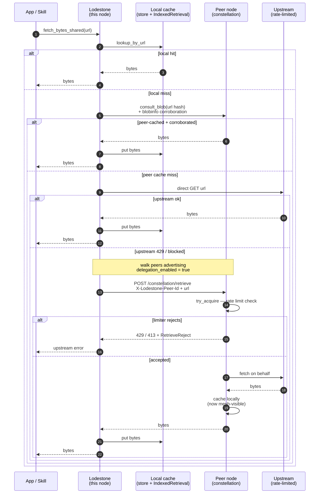
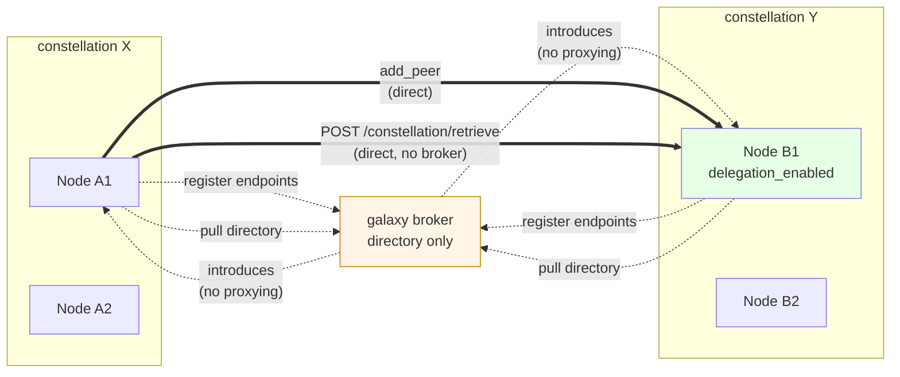
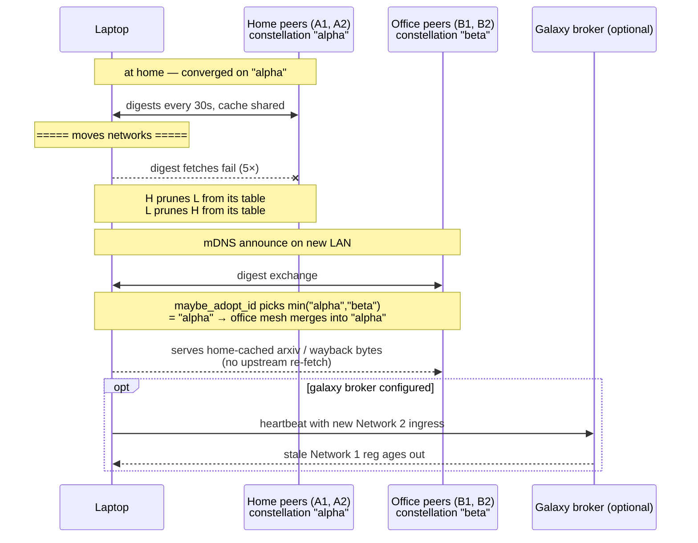

# Constellation — peer-to-peer shared query knowledge

The constellation is an **opt-in** layer that lets lodestone instances consult each
other's caches before scraping the open web. A query already answered by a peer
can be served from the network, spreading load and softening per-IP rate limits.

It is **never a dependency**: with zero peers (or the feature off) every instance
works exactly as a standalone server. It is **off by default** (`[network].enabled
= false`).

## Terminology

These terms are used throughout this page (and in the config/tools); definitions
come first so the rest reads unambiguously.

**Structure**

- **Instance** / **node** — one running `lodestone-mcp` server. The two words are
  used interchangeably here ("node" when talking about the graph, "instance" when
  talking about the process).
- **Peer** — another instance this node knows about and can consult.
- **Constellation** — a single mesh of instances that discover each other **directly**
  (static `[network].peers` + LAN mDNS) and share caches. The base layer; this whole
  page is about it unless the galaxy is named.
- **Galaxy** — an *optional* layer above constellations that links **multiple
  constellations** across networks. See [Galaxy](#galaxy--linking-constellations).
- **Broker** — the separate `lodestone-galaxy` binary at the center of a galaxy: a
  directory of `{ constellation → public endpoint(s) }`. It **never proxies** traffic;
  it only hands back endpoints so constellations talk directly.

**Identity**

- **`node_id`** — a stable id for *one instance* (OS machine id + bind port; override
  `[network].node_id`). Unique per process, stable across restarts.
- **constellation id** — a *shared* id for all members of one constellation
  (`[network].id`, distinct from `node_id`). Nodes that reach each other **converge to
  the smallest id**, so a mesh registers in the galaxy as one entry, not one per node.
- **`ingress`** — a constellation's publicly-reachable URL(s), registered with a broker
  so other constellations can connect inbound.

**Mechanism**

- **Digest** — what a node publishes every `sync_secs` at `GET /constellation/digest`:
  a Bloom filter of the key hashes it has cached, plus its known peers (for gossip).
- **Bloom filter** — a compact probabilistic set: lets a peer ask "do you *maybe* have
  this hash?" without listing contents. Hashes only — never raw query text.
- **Consult / consensus** — on a local cache miss, a node *consults* Bloom-matching
  peers for a key and trusts the answer only when `>= min_agreement` peers
  **corroborate** it (reputation-weighted) — the anti-poisoning gate.
- **Relay** — forwarding a consult a hop or two (≤ `relay_hops`, max 2) toward a node
  that holds the key, for peers not reachable directly.
- **Gossip** — including known-peer lists in the digest so the mesh grows from a seed.
- **Reputation** — a per-peer score (EMA) of how well a peer's answers match consensus
  / local truth; weights its votes and decays toward neutral when unreachable.

**Data shared**

- **Blob** — a cached *file's raw bytes* (from the `[store]` file store, e.g. a fetched
  PDF), shared over the mesh addressed by content hash.
- **Seed ratio** — per-blob `served_bytes / fetched_bytes` (BitTorrent-style), surfaced
  by `constellation_seeds`.

## Guarantees

- **Privacy.** Only *hashes* of normalized query keys cross the wire — never raw
  query text. Peers advertise a Bloom filter of the hashes they have cached;
  a query is a single hash; a response is a cached result list or nothing.
- **No secrets.** Responses contain only cached *search results* (public web
  data). Tokens/keys are never shared.
- **Anti-poisoning.** Peer data is untrusted. A result is returned without a local
  search only when at least `min_agreement` peers corroborate it; each peer's
  contribution is capped (`max_results_per_peer`); and peers are weighted by a
  reputation score (EMA toward how well they agree with consensus / local truth,
  decayed toward neutral when unreachable). No single peer can carry a result.
- **Bounded.** `max_peers`, `request_timeout_ms`, and capped lists bound the work
  and latency any one query can incur.

## Avoiding request storms

A consult can fan out and (with `relay_hops > 0`) be forwarded a hop or two toward a
holder, and the galaxy links many constellations into a larger mesh — so the system
is designed so the *same* query is never screamed around repeatedly:

- **Hop ceiling.** Relay TTL is clamped to `relay_hops` (max **2**). A forwarded
  query can only travel a couple of hops before it stops, so depth is hard-bounded.
- **Path loop-guard.** Every relayed query carries a `seen` set of node ids; a node
  that finds itself already in `seen` returns nothing. Node ids are machine-derived
  and globally unique, so this breaks loops *within and across* constellations alike.
- **Cross-path dedup.** `seen` only covers one path, so the same key could still
  arrive via several paths. Each node therefore **relays a given key at most once per
  short window** — duplicates answer from local cache only and are *not* re-fanned.
  This collapses the multiplicative fan-out that would otherwise cause a storm.
- **Targeted fan-out.** Relays go only to **Bloom-matching** peers (likely holders),
  not to everyone, and are capped by `max_peers`.
- **One vote per peer.** However a top-level peer answered (directly or via relay),
  it counts as exactly one consensus vote — relaying can't fabricate corroboration.
- **The galaxy never proxies.** The broker only hands back endpoints; it never
  forwards a query, so it adds no amplification path. Cross-constellation consults are
  ordinary direct calls, subject to all of the above.
- **Cache short-circuit.** A node that already has the answer cached returns it
  immediately and relays nothing.

## Matching reworded queries

Peers match by the **hash** of a query key, so two nodes only share a result when
they compute the *same* key. To stop trivial wording differences from fragmenting
that, the key's text is **canonicalized** before hashing: lowercased, de-punctuated,
stop-words and excess whitespace removed — but **word order is preserved**, so
direction-sensitive phrasings stay distinct (`json to yaml` ≠ `yaml to json`). So
"How do I parse JSON in Rust?" and "parse json rust" already hit the same entry.

For genuinely different phrasings of the same need, enable `[search].fuzzy_match`.
Each search is then *also* keyed by an order-independent **concept signature** (a
stemmed, de-duplicated token set), and that concept hash is advertised in the digest
Bloom like any other key — so a peer that cached an equivalent query is found on an
exact-key miss, through the same consult + consensus path (no protocol change, still
hash-only on the wire). It's off by default because a bag-of-words signature is
order-insensitive and can collide on direction-sensitive queries. (A SimHash-based
*near*-duplicate match — catching one-token-different queries — is a deferred
extension; see [TODO.md](../TODO.md).)

## How it works

1. **Discovery & gossip.** Static `[network].peers` plus, when `[network].mdns`
   is on, LAN auto-discovery via mDNS (`_lodestone._tcp.local.`, advertising the
   node id in a TXT record so a node skips itself). On top of that, each digest
   **gossips** the peers a node knows, so the mesh grows from a seed; peers that
   fail repeatedly are pruned.
2. **Digests.** Every `sync_secs`, each node fetches peers' `GET /constellation/digest` —
   a Bloom filter of the query-key hashes they currently have cached, plus their
   known peers (for gossip) — which also builds the **graph** of who-knows-whom.
3. **Consult-then-fetch.** On a search, after a local cache miss, the node asks
   the peers whose Bloom filter *might* contain the key (`POST /constellation/query` with
   the hash). If consensus is reached (`>= min_agreement` corroborating peers), it
   returns that merged result labelled `constellation` and **skips re-scraping**. Otherwise
   it runs a normal local search, caches it, and updates peer reputations by how
   well their hits matched the local truth.
4. **Relay (a hop or two).** When a node can't reach a holder directly, it asks
   reachable intermediaries to forward the query along the graph for up to
   `relay_hops` hops (clamped to 2). Each `/constellation/query` carries a `ttl` and a
   `seen` node-id set: a peer serves from its own cache, else (while `ttl > 0` and
   not already visited) forwards to its bloom-matching peers one hop closer.
   Loops are broken by `seen`; fan-out is bounded by `max_peers` and the timeout.
   Crucially, each *top-level* peer is still exactly **one** consensus vote no
   matter how many sub-peers it relayed through — so relaying can't manufacture
   corroboration.
5. **Reputation persistence.** With `[network].state_file` set, peer reputations
   are written there after each sync and reloaded on startup, so earned trust
   survives restarts.

## Inspecting the mesh

The **`constellation_status`** tool (skill) returns this node's id and every known peer's
reputation, reachability, miss count, and the graph edges it advertised. It
reports that the constellation is disabled when `[network].enabled` is false.

The result cache (`[cache]`) is the shared substrate: a node serves peers from the
same cache it fills with its own searches. Enabling the network therefore implies
an active cache even if `[cache].enabled` is false.

## Endpoints

Mounted only when `[network].enabled`. All require `Authorization: Bearer
<[network].token>` when that token is set (a trust domain separate from the public
`auth_token`); `/health` and `/mcp` are unaffected.

| Method | Path | Body | Response |
| --- | --- | --- | --- |
| `GET` | `/constellation/digest` | — | `{ node_id, generation, count, bloom: { m, k, bits }, peers: [...] }` |
| `POST` | `/constellation/query` | `{ "key": "<hash>", "ttl"?: n, "seen"?: [ids] }` | `{ "hits": [...] }` or `204` |
| `POST` | `/constellation/blob` | `{ "key": "<hash>" }` | raw bytes (`application/octet-stream`) or `204` |
| `POST` | `/constellation/blobinfo` | `{ "key": "<hash>" }` | `{ "hash": "<content-hash>", "size": n }` or `204` |

`ttl`/`seen` are optional (default 0 / empty) — a plain `{ "key": … }` works and
just disables relay for that request.

## File sharing (blobs)

When the on-disk file store (`[store]`) is enabled, the digest's Bloom filter also
advertises the **file-store entry hashes**, and peers can pull a cached file's raw
bytes via `POST /constellation/blob` (addressed by `hash_key(url)` — the raw URL never crosses
the wire). `read_pdf` and `store_fetch` resolve a URL as **local store → a constellation peer
that has it → the source** (caching the result), so a PDF/file one node fetched
(arXiv, IETF, …) is served from the mesh instead of every node re-hitting the
rate-limited source. The retrieval *text* cache is shared the same way (also behind
the Bloom), so parsed page/RFC/doc text one node produced isn't recomputed by every node.

### Multi-identifier retrieval entries

The retrieval cache used to key each entry by a single canonical string (e.g.
`wayback|max|ts|<url>`). The mesh could only help a consumer that asked by the
*exact* same canonical key, which broke for long-tail rate-limited content
because two peers cached under different per-skill formats would never see
each other.

The cache is now a **multi-index** keyed by an [`Identifiers`](../src/constellation/identifiers.rs)
set:

- the **primary canonical key** (the per-skill cache string, hashed);
- **URL aliases** — every URL that resolves to the body (raw URL, resolved
  snapshot URL, redirected URL, …);
- **source-specific identifiers** — `("arxiv", "1706.03762v5")`,
  `("wayback_ts", "20240315120000")`, `("doi", "10.48550/arXiv.1706.03762")`,
  …, namespaced by [`Source`](../src/constellation/identifiers.rs) so different
  upstreams can't collide on identical `(label, value)` pairs;
- the **content hash** of the body (computed at put-time).

Each entry advertises **every** identifier hash in the digest Bloom (capped at
8 per entry to keep the digest small), so a peer that asks by any one of them
gets a hit. A consumer asking `https://arxiv.org/abs/1706.03762v5` finds an
entry a peer cached under the source-id `("arxiv", "1706.03762v5")` and vice
versa.

### Per-source consensus policy

Sources fall into two safety classes. `consult_blob_hash_sourced` accepts a
[`Source`](../src/constellation/identifiers.rs) hint so the right policy
applies per call:

| Source | TTL override | `min_agreement` floor | Why |
| --- | --- | --- | --- |
| `Wayback` | 7 days | **1** | `(url, timestamp)` is content-addressable; consumer-side bytes-hash check is the primary safety |
| `Arxiv` | 7 days | **1** | `{id}+v` is immutable per version; consumer can verify |
| `Github` (releases) | 7 days | **1** | Tag-addressable, immutable |
| `Overpass` | 1 day | `max(cfg, 2)` | World data changes slowly; consensus matters because bytes can't be verified from the query |
| `SearchEngine` | 1 hour | `max(cfg, 2)` | Volatile; consensus matters |
| `Other` | global default | global default | Fallback for entries that don't classify their source |

For **content-addressable sources** the `min_agreement` floor drops to **1**
*regardless* of `[network].min_agreement`. The safety doesn't come from peer
consensus — it comes from the consumer's content-hash check (step 3 of
"Anti-tampering" below). Requiring multiple peers to corroborate a hash a
single peer derived from the same identifier the consumer was looking up by
adds latency without adding safety. This is the change that makes long-tail
rate-limited content (a specific arXiv paper, a specific Wayback snapshot)
actually serveable across the mesh — usually only one peer in the constellation
has any given long-tail entry.

For **volatile / non-content-addressable sources** the existing multi-peer
corroboration applies, and a user that hardens to
`[network].min_agreement = 3` is never silently relaxed.

The same per-source floor applies to the **search-result consensus path**
(`consult` → `consensus`, separate from the blob-hash path). Search results
are inherently `Source::SearchEngine` and use `max(cfg.min_agreement, 2)`:
even a user that relaxes `cfg.min_agreement = 1` doesn't accept lone-peer
search results, because there's no consumer-side verification for search
hits (you can't recompute a search ranking the way you can recompute a
content hash), so a single (potentially malicious) peer could otherwise
inject results.

### End-to-end delegation flow



Five doors checked in order: **local store → peer cache → direct upstream →
peer-delegated fetch → error**. Steps 2 and 4 require `[network].enabled`;
step 4 additionally needs at least one peer advertising
`delegation_enabled = true`. With none of those configured this collapses to
plain HTTP.

### Cross-constellation transfer



The broker is a **directory**, not a proxy — it learns each constellation's
ingress endpoints and tells the others. Once introduced, constellations
talk **direct**: a node in X adds nodes in Y as peers via the normal
`add_peer`, fetches their digest, sees `delegation_enabled = true`, and
POSTs `/constellation/retrieve` directly. The bytes never touch the broker.

### Retrieval delegation (opt-in)

When local cache + peer-cache both miss and the direct upstream fetch fails
(rate-limited, geo-blocked, captive-portalled), a peer that has opted into
delegation can perform the fetch on the consumer's behalf. The asking node
POSTs `/constellation/retrieve { url, max_bytes, source }`; the serving
node fetches from upstream, caches the body locally (so it serves the mesh
via the Bloom-gated `consult_blob_hash` path going forward), and returns
the bytes. The rate-limited upstream is hit **once for the mesh**, not
once per node.

**Lookup order for `fetch_bytes_shared` is therefore:**

1. **Local file store** — already-downloaded bytes.
2. **Peer cache** (via `consult_blob`) — a peer that has it served the
   bytes; consensus / verification applies per source.
3. **Direct upstream fetch** — plain HTTP. On any error (typically 429),
   fall through.
4. **Peer-delegated fetch** — ask a peer that advertised
   `delegation_enabled = true` to fetch it for us.

Steps 2 and 4 require `[network].enabled` and at least one peer; step 4
additionally requires at least one peer that advertised
`delegation_enabled = true` on its most recent digest. The path collapses
gracefully — with none of those configured, this is just a plain HTTP
download.

**Cross-constellation delegation** works automatically through the galaxy
broker's directory mechanism: when a foreign constellation's endpoints are
added as peers via `galaxy::client::sync_once`, their digests start being
fetched, the `delegation_enabled` flag becomes visible, and
`delegated_fetch` walks all peers regardless of constellation origin. The
broker itself is **not a proxy** — bytes flow constellation-to-constellation
direct, the broker only made the introduction.

**Guardrails (server side).** When a serving node opts in
(`[network].delegation_enabled = true`), three sliding-hour-window counters
protect it from being used as someone else's exit:

| Knob | Default | What it caps |
| --- | --- | --- |
| `delegation_max_jobs_per_peer_per_hour` | 30 | Jobs any one peer can request per hour. A misbehaving peer fills its own quota first. |
| `delegation_max_bytes_per_job` | 8 MiB | Body size of a single delegated fetch. |
| `delegation_total_bytes_per_hour` | 256 MiB | Aggregate bytes served via delegation per hour. Protects local egress. |
| `delegation_max_cache_bytes` | 64 MiB | Summed body size of all retrieval-cache entries (delegated or not). Eviction is oldest-by-expiry. 0 = unlimited. |

Rejected requests return HTTP 429 (peer-jobs / global-bytes) or 413 (per-job
size) with a JSON body carrying a machine-readable `reason` and a
`Retry-After` hint in seconds, so requesters back off intelligently rather
than re-bombard the peer.

**Privacy.** The requested URL **does** cross the wire here — the serving
node has to know what to fetch — so delegation is strictly opt-in for the
serving node, never on by default. The requester has no privacy obligation
since it knows the URL it asked for; the constellation `token` gates who
can ask in the first place.

### Anti-tampering

A peer could serve corrupted or malicious bytes, so blobs are **corroborated, then
verified** before they're trusted:

1. The consumer asks Bloom-matching peers for the blob's **content hash** only
   (`POST /constellation/blobinfo`, no bytes).
2. It trusts a content hash only when **`>= min_agreement` distinct peers
   agree** on it (reputation breaks ties) — the same anti-poisoning gate as search
   results, so a lone or malicious peer can't dictate content. The effective
   `min_agreement` is computed per call from the per-source policy table
   above: 1 for content-addressable upstreams, `max(cfg, 2)` for everything
   else.
3. It fetches the bytes from an agreeing peer and checks they hash to the agreed
   value (`hash_bytes`) before accepting; on any mismatch it re-fetches from the
   authoritative source.

The content hash is a deterministic 128-bit FNV digest (same family as the key
hashes), so every honest node computes the same value for identical bytes.

### Seed accounting

Each node tracks, per blob hash, how many bytes it has **served** to peers vs.
**fetched** from them (`served_bytes / fetched_bytes` = a BitTorrent-style *seed
ratio*). Surfaced by the `constellation_seeds` tool and shown per file in `store_list`.

### Node identity

Each node has a stable id derived from the **OS machine id** (`machine-uid`; falls
back to hostname, else random) mixed with the bind port — so two instances on one
host stay distinct, yet each is stable across restarts. Peers record each other's id
from their digests; `constellation_status`/`constellation_peers` show it. Override with
`[network].node_id`.

## Auto-healing on network change

A constellation **survives a node moving between networks**. The path is
fully unattended — nothing needs restarting, no configuration touches —
because every part of the design assumes the mesh is unreliable.

What actually happens when a laptop in mesh **alpha** at home moves to a LAN
with peers already in mesh **beta**:

1. **Old peers age out.** Each `sync_secs` cycle (default 30s) the node tries
   to fetch every known peer's `/constellation/digest`. The Network 1 IPs
   don't route from Network 2, so the fetches fail. After `MAX_PEER_MISSES`
   (5 consecutive failures = ~2.5 min on defaults) each old peer is pruned.
   Their `Peer` record is dropped, in-flight `consult_blob_hash` /
   `delegated_fetch` against them time out per `[network].request_timeout_ms`
   and the chain falls through to the next door (direct upstream).
2. **New peers appear via two channels.** **mDNS** (if
   `[network].mdns = true`) announces under `_lodestone._tcp.local.` on the
   new LAN within seconds; other lodestone instances on the same broadcast
   domain auto-discover. **Gossip** then propagates: each peer's digest
   carries a sample of its own known peers, so once the laptop talks to
   *one* node on Network 2 it learns about the rest. If neither mDNS nor a
   `[galaxy]` broker nor `[network].peers` matches anything reachable, the
   node runs as a lone constellation until discovery — its caches still
   work locally with zero peers.
3. **The constellation_id merges to the smaller of the two.** Each digest
   carries the advertiser's `constellation_id`. When the moved node sees a
   digest from a peer in a *different* constellation, `maybe_adopt_id` picks
   the alphabetically-smaller id deterministically:
   - laptop = `"alpha"`, office mesh = `"beta"` → `"alpha"` wins. The
     office mesh's nodes adopt `"alpha"` as they sync with the laptop, and
     the office mesh effectively **merges into** the laptop's home
     constellation.
   - laptop = `"beta"`, office mesh = `"alpha"` → reverse. The laptop
     adopts `"alpha"` on its next sync. The home mesh the laptop left
     behind keeps its `"beta"` id and just loses one peer from each table.
   - Same id on both sides → no-op (they were already the same
     constellation).
4. **The cache is preserved — the moving node is a *bridge*.** Every entry
   in the laptop's `IndexedRetrievalCache` and file store survives the
   network switch (same process, in-memory). The new digest re-advertises
   every identifier hash. So an arXiv paper the laptop cached at home is
   served to office peers via the existing `consult_blob_hash` flow with
   **no re-fetch from arXiv**. A roaming laptop carries warm cache between
   networks, and the upstream is hit *once for both meshes combined*.
5. **The galaxy broker reregisters lazily.** `galaxy::client` heartbeats
   every `heartbeat_secs` with current `ingress` endpoints. After the move
   the heartbeat sends the new Network 2 IPs; the broker's TTL expires the
   old Network 1 registration. Other constellations pulling the directory
   get the new endpoints. Until the heartbeat fires (typically minutes),
   peers pulled via galaxy still see the laptop's old endpoints — same
   prune logic catches that.

**Practical edges**:

- **Rate-limit counters survive the move** (same process). A peer-id that
  hit its delegation quota on Network 1 stays at quota when it reappears
  on Network 2.
- **Reputations** stay in memory across the move; `state_file` only
  persists across *restarts*.
- **No mDNS, no galaxy, no static peers configured on the new network** →
  laptop runs as a single-node constellation until something is reachable.
  Its caches keep serving locally to any skill on the same node, which is
  often enough.
- **The home mesh forgets the laptop** about 2-3 minutes after it
  disappears (one full `sync_secs` × `MAX_PEER_MISSES`).



Short version: the constellation auto-heals, the moving node carries warm
cache between networks, and meshes converge by id when they meet — so two
co-located meshes a bridging node touches merge cleanly into one.

## Configuration

See [`config/06-network.toml`](../config/06-network.toml) for every option with
defaults and the matching `LODESTONE_NETWORK_*` env vars.

## Two-node test

```sh
# Node A (will fill its cache and serve B)
LODESTONE_BIND=127.0.0.1:8000 \
LODESTONE_NETWORK_ENABLED=1 LODESTONE_NETWORK_MDNS=0 \
cargo run

# Node B, pointed at A, with min_agreement=1 so a single peer is trusted in the
# demo (production keeps the default of 2+)
LODESTONE_BIND=127.0.0.1:8001 \
LODESTONE_NETWORK_ENABLED=1 LODESTONE_NETWORK_MDNS=0 \
LODESTONE_NETWORK_PEERS=http://127.0.0.1:8000 \
LODESTONE_NETWORK_NODE_ID=node-b \
cargo run
```

Run a `web_search` on **A** (fills A's cache). Within `sync_secs`, B pulls A's
digest. Run the *same* `web_search` on **B**: it returns a result whose `meta`
reads `constellation: N peers` — served from A without B scraping. `list_providers` and the
logs show the activity.

On a real LAN, leave `mdns = true` and omit `peers`; nodes find each other
automatically.

## Galaxy — linking constellations

A **constellation** is a single mesh of instances that discover each other directly
(static peers + LAN mDNS). A **galaxy** is the next layer up: a small **broker** that
links *multiple constellations* across networks. Configure it under `[galaxy]`.

> **Galaxy connectivity is entirely optional.** It is off by default and is never a
> dependency: a constellation is fully functional on its own (and a single instance
> works with no constellation at all). The galaxy only *adds* cross-network discovery
> of other constellations — nothing breaks, and no behavior changes, without it.

It is deliberately **not a proxy** — the broker never relays digests, queries, or
blobs. It only keeps a directory of `{ constellation id → public endpoint(s) }`. A
constellation registers its publicly-reachable **ingress** URL(s); peers fetch the
directory and then talk to each other **directly** over the normal `/constellation/*`
endpoints (under each constellation's own token + consensus rules). So at least one
host must be publicly reachable — usually the broker, plus each constellation's
ingress node(s) (a forwarded/open port).

Two sides (independent):

- **The broker is a separate binary**, `lodestone-galaxy` — *not* part of the main
  `lodestone-mcp` server (the MCP server + its constellation are the main app). Run it
  on a publicly-reachable host; configure it by env:

  ```sh
  LODESTONE_GALAXY_BIND=0.0.0.0:8077 \
  LODESTONE_GALAXY_TOKEN=optional-shared-secret \
  LODESTONE_GALAXY_TTL_SECS=90 \
    lodestone-galaxy            # or: lodestone-galaxy 0.0.0.0:8077
  ```

  Endpoints: `POST /galaxy/register` (also `…/heartbeat`) and
  `GET /galaxy/directory?id=<self>`; both honor the token. Entries expire after the
  TTL without a heartbeat. It only stores/returns endpoints — never proxies traffic.
- **Participate** (`[galaxy].servers = [...]` in the main app, with the constellation
  enabled): every `heartbeat_secs`, register this constellation (its `id` + `ingress`
  URLs) with each broker and pull the directory, adding other constellations'
  endpoints as peers.

**One id per constellation.** Member nodes share a single **constellation id**
(`[network].id`; distinct from each node's `node_id`). It's random if unset, and
nodes that reach each other **converge to the smallest id** — so a multi-node
constellation registers as *one* entry in the galaxy (not one per node), and two
meshes that find each other on a network **merge** into a single constellation. The
galaxy client registers under this id unless `[galaxy].id` overrides it.

**Bidirectional ("reach out" *and* "allow in").** Participation is two-way and
symmetric through the directory: **registering** your `ingress` makes you discoverable
so other constellations connect *to* you (traffic in), while **pulling** the directory
adds their endpoints as peers so you connect *to* them (reach out). Both happen each
cycle. A node with no public `ingress` can still pull-and-consult (outbound-only);
a node with `ingress` is also reachable (inbound). The broker never proxies — all
constellation traffic is direct.

**Distribution.** A constellation may advertise **several `ingress` endpoints** — all
are added as peers, spreading inbound load across member nodes. Egress is distributed
too: every member node runs its own galaxy client and registers independently.

**Join order.** A node **joins its own constellation first** — the galaxy client
waits out a warm-up (`join_warmup_secs`, returning sooner once a local peer appears)
so local discovery settles before it asks a broker about *other* constellations.

> **Expose only the constellation, not the MCP server.** Set `[network].bind` to a
> separate port so `/constellation/*` listens apart from `/mcp`; forward *that* port
> as your `ingress` and keep the MCP endpoint private. (See the constellation config.)

A node can be a pure broker (set `serve = true`, leave the constellation off), a pure
participant, or both.

## Deferred

A Redis-backed *shared* cache (multiple nodes behind one store) — so peers read
from a common cache instead of (or in addition to) consulting each other. See
[TODO.md](../TODO.md). (Gossip, bounded relay, and reputation persistence are now
implemented.)
