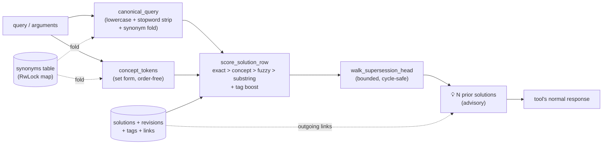
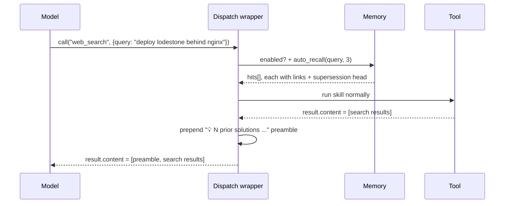
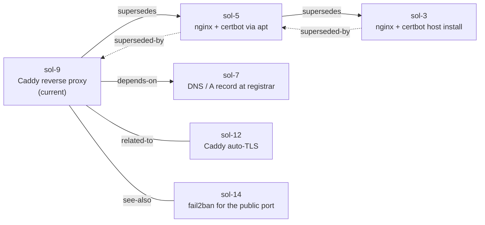
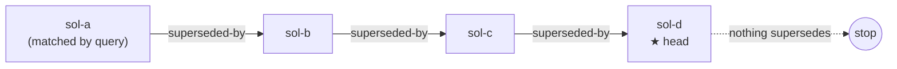
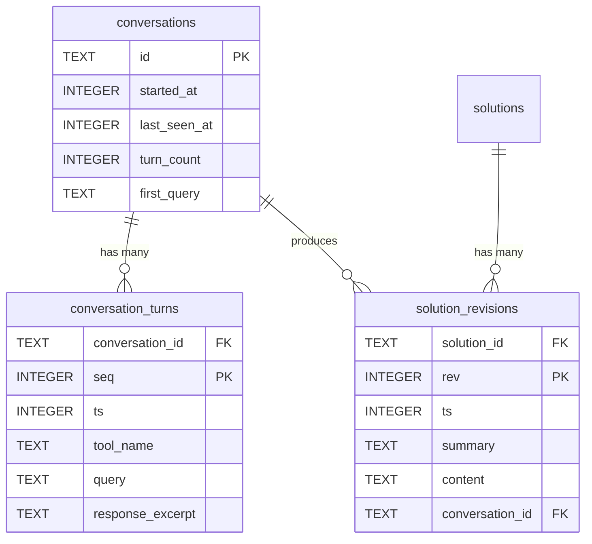
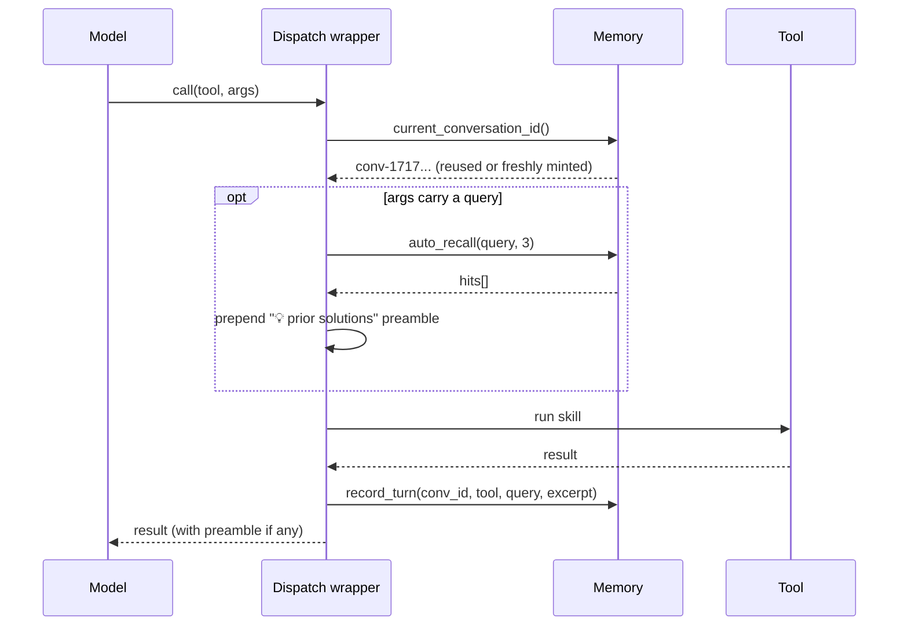

# Persistent memory

Lodestone has a SQLite-backed memory layer that survives across sessions. It
is **on by default** — to silence it, set `[memory].enabled = false` in
`config/18-memory.toml`. When disabled, none of the tools below exist and the
intrinsic recall wrapper is inert; the rest of the server is unaffected.

The layer has three discrete responsibilities, deliberately separated so the
model can reach for the right shape of memory without overloading one tool:

1. **Key→value notes** — small free-form remembered facts (`memory_*`).
2. **Solutions** — recorded "how I solved this" entries with revisions, tags,
   and a typed graph of relationships (`solution_*`).
3. **Synonyms** — single-token aliases that get folded everywhere queries are
   normalized, so a rewording finds the prior entry (`synonym_*`).

A fourth piece sits *over* all of these: **intrinsic recall**, a dispatch
wrapper that auto-prepends a "💡 prior solutions" preamble to every
query-bearing tool call. The model never has to call `solution_find` — recall
fires by itself.

> All recall hits are **advisory**. Old solutions may be stale; the model is
> instructed to verify before reusing, and to record an update when it learns
> better. The whole point of recording a solution is so the *next* attempt
> starts from real evidence, not from scratch — but advisory is not
> authoritative.

## Architecture at a glance



## Intrinsic recall — the dispatch wrapper

Every tool whose arguments carry a free-text `query` (the entire search family,
arxiv / wikipedia / pubmed / openalex / hf_* / standards / rfc / news / osm_* /
task_run / …) is wrapped at dispatch time. When the wrapper sees a non-empty
`query`, it:

1. Canonicalizes the query (folding synonyms).
2. Scores all stored solutions and keeps the top hits above a quality
   threshold.
3. For each kept hit, walks the `superseded-by` chain forward to find the
   current head.
4. Pulls each hit's outgoing typed links.
5. Prepends a "💡 N prior solutions" preamble block to the tool's response.



Tools in the **memory / solution / synonym** family are excluded from the
wrapper — otherwise calling `solution_find` would surface its own results as a
recall preamble, recurse, and become noise.

### What a preamble looks like

```
💡 2 prior solutions matching this (advisory — verify before reusing):
  • sol-3 (score 78.0): Deploy lodestone behind nginx with TLS
    ⚠ superseded — current head is sol-9; prefer it unless you specifically need the older approach
    summary: Old approach using certbot directly on the host
    links: ─superseded-by→ sol-5
    ↳ solution_graph id="sol-3" to walk further, solution_related id="sol-3" for ranked neighbors
  • sol-12 (score 64.5): Reverse-proxy lodestone with Caddy auto-TLS
    summary: Single-binary alternative; ACME without certbot
    links: ─related-to→ sol-9  ─depends-on→ sol-7
    ↳ solution_graph id="sol-12" to walk further, solution_related id="sol-12" for ranked neighbors
───
```

The `⚠ superseded` line is load-bearing: surfacing an obsolete hit without
pointing at the chain head would quietly steer the model into stale prior work,
which is the opposite of what the memory layer is for.

## Key→value notes — `memory_*`

A flat, scoped key→value store for anything that doesn't fit the
problem/solution shape — environment notes, "the staging cluster is in
`gke_a`", a one-off reminder.

| Tool | Purpose |
| --- | --- |
| `memory_save` | Write/overwrite `value` at `key`. Optional `scope`, `tags`, `note`. |
| `memory_get` | Read one key. |
| `memory_list` | List keys, optionally filtered by `scope` / `tags` prefix. |
| `memory_search` | Full-text-ish search across keys, values, notes. |
| `memory_forget` | Delete a key. Destructive — goes through the confirm-token guard. |

Notes are **not** considered by intrinsic recall. They're a separate surface;
use solutions when you want recall.

## Solutions — `solution_*`

A solution is a recorded answer to a recorded problem, with full revision
history. Use it when an approach is worth remembering — debugging recipes,
deployment patterns, "how I solved the X bug last quarter."

| Tool | Purpose |
| --- | --- |
| `solution_record` | Create a new solution for a `problem`. Stores rev 1 immediately. Optional `tags`. |
| `solution_find` | Explicit recall — same scoring as intrinsic recall but on demand. |
| `solution_show` | Full detail: every revision, tags, outgoing/incoming links. |
| `solution_list` | List by tag / canon prefix / recency. |
| `solution_update` | Append a new revision to an existing solution. History is preserved. |
| `solution_forget` | Delete a solution (cascades to revisions / tags / links). Destructive. |

### Ranking

`score_solution_row` is a deterministic ranker, not an embedding model. The
scoring goes:

| Match | Score |
| --- | --- |
| Exact canonical-query match | 100 |
| Exact concept-token match (order-free) | 80 |
| Fuzzy concept-token Jaccard | 20 + 40·j |
| Substring in problem / summary | 15 |
| Per shared tag | +5 |

Threshold for intrinsic recall is 30, so a one-tag-overlap-only match doesn't
fire — the preamble stays high signal.

### The graph layer

Solutions can be linked with **typed, auto-reciprocal edges**. Writing
`supersedes` from A→B automatically writes `superseded-by` from B→A; the same
holds for `depends-on` ↔ `dependency-of`. Symmetric kinds (`alternative-to`,
`related-to`, `see-also`, or any custom kind) write the same kind in the other
direction.



| Tool | Purpose |
| --- | --- |
| `solution_link` | Create a typed edge `from → to`. Reciprocal written automatically. |
| `solution_unlink` | Remove an edge (and its reciprocal). |
| `solution_graph { id, depth?=2 }` | BFS-walk the typed edges from `id` out to `depth` (capped at 5). Returns nodes + edges. |
| `solution_related { id, max?=10 }` | Ranked neighbor list combining explicit-link weight (30/link) + shared tags (2/tag) + concept-token Jaccard (20·overlap). |

### Supersession chain walking

When intrinsic recall surfaces a hit, it walks `superseded-by` edges forward
from the hit until it lands on a node nothing has superseded — the **head**.
The walk is bounded (5 hops) and uses a visited set so a malformed cycle in
`solution_links` can never lock the recall path.



The preamble then reads:

```
⚠ superseded — current head is sol-d; prefer it unless you specifically need the older approach
```

Only directional kinds (`supersedes` / `superseded-by`) get walked
transitively. Symmetric kinds stay at one hop in the preamble because
"related-to-related-to" is just weaker relatedness — chasing it dilutes the
signal.

## Conversations — `conversation_*` / `solution_conversations`

The dispatch wrapper writes one row to `conversation_turns` per tool call.
Turns are grouped into `conversations` by an **idle-gap heuristic** — 30
minutes of silence ends one conversation and starts the next. No client
cooperation required; no session id is asked for. When `solution_record` or
`solution_update` runs inside a conversation, the new revision is back-linked
to it.

A conversation is **has-many** to turns (`conversation_turns.conversation_id`)
and **has-many** to solution revisions
(`solution_revisions.conversation_id`). Because a single solution can be
updated across multiple conversations (revisions 1, 2, 3 each from a different
session), a solution is **many-to-many** to conversations via revisions.



The dispatch wrapper looks like this end-to-end:



| Tool | Purpose |
| --- | --- |
| `conversation_list { max?=20 }` | Recent conversations, most-recently-active first. |
| `conversation_show { id, max?=100 }` | Walk one conversation chronologically — every tool call, with query and a short response excerpt, plus the solutions whose revisions were produced. |
| `solution_conversations { id }` | The conversation(s) a solution came from, grouped by which revisions each one produced. |

`solution_show` also prints the `conversation_id` next to each revision. So
the typical traversal flow is:

```
[recall preamble surfaces sol-3]
  → solution_show id="sol-3"     (see its revisions and which conversation each came from)
  → conversation_show id="conv-1717..."
     (see "what else happened in that conversation": adjacent searches, fetches, the surrounding context)
```

### Limitations

- **Identity is per-process, not per-client.** MCP doesn't hand the server a
  stable per-user session id, so the wrapper uses one global "active
  conversation." If one server is shared by multiple concurrent clients,
  their turns will mix. The local-LLM-runner case (one client at a time) is
  the design target.
- **No `conversation_forget` yet.** Conversations are durable; deleting a
  solution does not delete the conversations it touched. Adding a destructive
  cleanup tool later is straightforward (CASCADE is already wired).
- **The idle gap is hardcoded at 30 minutes.** Tunable later if it turns out
  to be too aggressive or too lax.

## Synonyms — `synonym_*`

A single-token alias map: `token` → `canonical`. The fold runs in both
`canonical_query` (used for the search cache key and for solution scoring) and
`concept_tokens` (used for fuzzy match). The store ships **empty** — there's
no hardcoded `k8s`→`kubernetes` table; the model and user grow it as they
learn.

| Tool | Purpose |
| --- | --- |
| `synonym_add` | Insert `token` → `canonical` (both lowercased). |
| `synonym_remove` | Delete an entry. |
| `synonym_list` | Read the whole table. |

A practical effect: once `synonym_add token="k8s" canonical="kubernetes"` is
stored, `web_search { query: "k8s deploy" }` and `web_search { query:
"kubernetes deploy" }` hit the same cache slot, *and* recall the same prior
solutions. The same fold is what makes intrinsic recall robust to surface
wording changes.

## Configuration

Everything lives in `config/18-memory.toml`:

```toml
[memory]
enabled = false             # master switch
dir = ".lodestone-memory"   # SQLite store lives here
allow_destructive = false   # pre-authorize memory_forget / solution_forget
max_entries = 10000         # soft cap per store (memories or solutions)
max_value_chars = 64000     # per-value cap on memory value / solution content
```

Environment overrides: `LODESTONE_MEMORY_ENABLED`, `LODESTONE_MEMORY_DIR`,
`LODESTONE_MEMORY_ALLOW_DESTRUCTIVE`.

When `enabled = false`, none of the `memory_*` / `solution_*` / `synonym_*`
tools are advertised in `tools/list`, and the dispatch wrapper short-circuits
without touching the DB.

The intrinsic-recall thresholds are currently constants in the code, not
config: a hit must score **≥ 30** to be surfaced, and the preamble shows at
most **3 hits**. Both numbers are deliberately conservative — recall is a
prompt-context cost, so the bar to fire is high.

## Destructive tools

The following are destructive and go through the standard golden-rule-8
confirm-token guard — they return a one-time `CONFIRM` token on the first call
and do nothing; you have to call again with `confirm=<token>` (add
`trust=true` to whitelist that exact action for the session, or pre-authorize
the family with `allow_destructive = true` in the config):

- `memory_forget`
- `solution_forget`

`synonym_remove` and `solution_unlink` are also data-changing but small enough
to fire without the handshake — they're cheap to undo by re-adding the same
edge.

## What this means for the model

- **You almost never have to call `solution_find`.** Recall fires for free on
  every search-shaped tool. Read the preamble first, then your tool's results.
- **Treat the preamble as advisory.** Verify before reusing, and call
  `solution_update` (or `solution_link supersedes`) when you learn better.
- **If a hit is marked `⚠ superseded`, prefer the head id.** That's what the
  head walk is telling you. The obsolete record is still listed so you have
  the history, not because you should reuse it.
- **Walk the graph when the cluster matters.** A hit's outgoing links are
  printed inline; `solution_graph` and `solution_related` go further.
- **Teach the server new synonyms when you notice the same idea getting
  re-asked under different wording.** A single `synonym_add` line makes
  *every* future cache and recall robust to that phrasing change.
