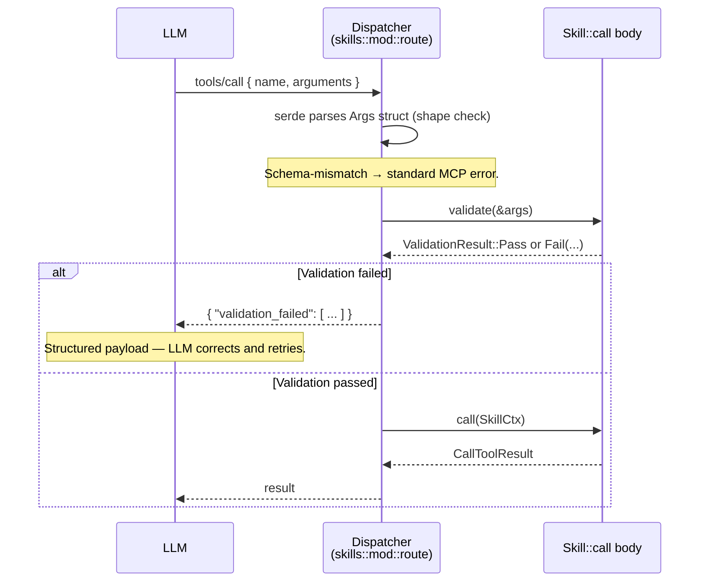

# Skill input validation

This document explains the declarative validation framework every
`Skill` participates in. It's the long-form reference behind the short
section in [CONTRIBUTING.md](../CONTRIBUTING.md#adding-a-skill--adding-a-tool):
contributors should skim CONTRIBUTING for the contract, then return here
when they need the full rule shape, evaluation semantics, error payload
contract, or composition patterns.

[Golden rule 15](golden-rules.md) makes this contract mandatory —
every skill whose Args carry domain constraints beyond what serde /
schemars already enforce declares them via `validation_rules()`.

Module: [`src/skills/validation.rs`](../src/skills/validation.rs).
Tests: same file, `mod tests`.

## Why a validation framework

`schemars::JsonSchema` and `serde` together handle **shape** — types,
required vs optional fields, "this must be an integer" — and reject
malformed JSON before `call()` ever runs. They don't handle **domain
constraints**: "the integer must be in 100..599", "exactly one of `data_ascii`
or `data_base64`", "this string must look like a CVE id".

Before 0.1.16, every skill grew an imperative validation pass at the top
of its `call()`:

```rust
fn call<'a>(&self, ctx: SkillCtx<'a>) -> BoxFuture<'a, Result<CallToolResult, McpError>> {
    Box::pin(async move {
        let (_, args) = ctx.parse::<MyArgs>()?;
        if !(100..=599).contains(&args.code) {
            return Err(invalid(format!(
                "status code {} is outside the 100-599 range defined by RFC 9110",
                args.code
            )));
        }
        // ... business logic
    })
}
```

Three problems with that:
1. **The LLM sees prose, not structure.** It has to parse English to
   decide what went wrong and what to do next.
2. **The rules aren't introspectable.** `describe_skill` can't show
   them — they only exist as imperative Rust inside `call()`.
3. **The same patterns get rewritten dozens of times.** Range bounds,
   "exactly one of these", "non-empty list" appear across the codebase
   with subtly different prose for each.

The framework solves all three at once.

## Where validation runs



The dispatcher sits between `ctx.parse()` (shape) and the call body
(business logic). On failure the LLM gets a structured payload as the
**call result** — not as an error — so MCP clients render it the same
way they render any tool output.

## The `Skill` trait additions

```rust
pub trait Skill: ... {
    // ... existing methods ...

    /// Declarative rules evaluated by the dispatcher BEFORE the call body.
    /// Default returns &[] (no rules → zero dispatcher cost).
    fn validation_rules(&self) -> &'static [validation::Rule] {
        &[]
    }

    /// Imperative validation, default impl calls evaluate(self.validation_rules(), args).
    /// Override only when the declarative DSL can't express it.
    fn validate(&self, args: &JsonObject) -> validation::ValidationResult {
        validation::evaluate(self.validation_rules(), args)
    }
}
```

Most skills will only override `validation_rules()`. The framework
walks the static rule list and emits structured failures.

`validate()` is the escape hatch — override it directly when you need
imperative logic the DSL can't express (e.g. consistency checks across
multiple fields, expensive computation that requires the full args). The
default forwards to the declarative path so this is opt-in.

## The `Rule` DSL

Every variant is `Debug + Clone` and built as a `&'static [Rule]` so
there's no per-call allocation cost. The lifetime requirement is what
the trait method signature `&'static [Rule]` already enforces.

### `Range { field, min?, max? }`

Numeric bounds. Both ends are inclusive and optional (omit for
`-∞` / `+∞`). Works for any field that parses to `f64` (integers,
floats, fractional strings handled by the underlying serde type).

```rust
Rule::Range { field: "code", min: Some(100.0), max: Some(599.0) }
// "code must be 100-599"

Rule::Range { field: "p", min: Some(0.0), max: Some(100.0) }
// "p must be 0-100" — for percentiles

Rule::Range { field: "from_base", min: Some(2.0), max: Some(36.0) }
// "base must be 2-36"

Rule::Range { field: "timeout_ms", min: Some(0.0), max: None }
// "non-negative timeout, no upper bound"
```

If the field is absent or null → **skipped** (the framework only enforces
range on values that are present; required-ness comes from the Args
struct's serde annotations).

If the field is present but not a number → fails with
`message: "`{field}` must be a number"` and `expected: {"type":
"number"}`.

### `OneOf { field, values }`

String enum constraint. Case-sensitive. The values are a `&'static
[&'static str]` slice.

```rust
Rule::OneOf {
    field: "version",
    values: &["v4", "v7"],
}

Rule::OneOf {
    field: "encoding",
    values: &["base32", "base58", "base64url"],
}
```

Absent / null → skipped. Non-string → fails immediately.

### `Regex { field, pattern, summary }`

Pattern match. `pattern` is a Rust regex (the `regex` crate). `summary`
is a one-line human description that's shown in the error message
alongside the raw regex — LLMs digest the summary faster than the
pattern.

```rust
Rule::Regex {
    field: "cve_id",
    pattern: r"^CVE-\d{4}-\d{4,7}$",
    summary: "CVE-YYYY-NNNN(N)(N)(N)",
}

Rule::Regex {
    field: "country",
    pattern: r"^[A-Z]{2}$",
    summary: "ISO-3166 alpha-2 country code",
}
```

The regex is compiled per-call today. If a skill's rules show up in
benchmarks, we can switch to a `LazyLock<Regex>` cached at first use —
the DSL doesn't change.

A pattern that doesn't compile at code time is treated as "skip" rather
than "fail every input" — the rule is malformed, the user's input isn't.

### `Length { field, min?, max? }`

String / array length bounds. For strings, the count is Unicode
**characters** (not bytes — what the LLM intuits). For arrays, it's
the element count.

```rust
Rule::Length { field: "data", min: Some(1), max: None }
// "data must have at least one element"

Rule::Length { field: "limit", min: None, max: Some(50) }
// "limit must be at most 50 (long form for u32)"

Rule::Length { field: "secret", min: Some(8), max: Some(64) }
// "passphrase must be 8-64 chars"
```

### `ExactlyOne { fields }`

Exactly one of the named fields must be present and non-null. Native
support for the "supply either X or Y" pattern.

```rust
Rule::ExactlyOne { fields: &["data_ascii", "data_base64"] }
```

A common alternative to a tagged union in the Args struct when both
fields stay distinct types.

The error payload's `field` is the comma-joined name list (e.g.
`"data_ascii, data_base64"`) and `got` is the list of which fields were
actually present:

```json
{
  "field": "data_ascii, data_base64",
  "rule": "exactly_one",
  "expected": {"exactly_one": ["data_ascii", "data_base64"]},
  "got": ["data_ascii", "data_base64"],
  "message": "exactly one of [\"data_ascii\", \"data_base64\"] must be supplied; got [\"data_ascii\", \"data_base64\"]"
}
```

### `AtLeastOne { fields }`

At least one of the named fields must be present and non-null. Use when
you need "must supply at least one filter, but more is fine."

```rust
Rule::AtLeastOne { fields: &["keyword", "cpe", "published_after"] }
```

### `All(&[...])`

Conjunction. Every sub-rule must pass. Failures from every branch
**aggregate** in the error payload — the LLM sees all the problems at
once, not just the first.

```rust
Rule::All(&[
    Rule::Range { field: "from_base", min: Some(2.0), max: Some(36.0) },
    Rule::Range { field: "to_base", min: Some(2.0), max: Some(36.0) },
    Rule::Length { field: "number", min: Some(1), max: None },
])
```

At the top level of a Skill's `validation_rules()`, the implicit
combinator is already `All` — the framework evaluates every rule in the
list. Use explicit `All(...)` when you need to nest it under `Any` or
`Not`.

### `Any(&[...])`

Disjunction. At least one branch must pass. If **every** branch fails,
the error payload aggregates every branch's failures so the LLM sees
every path it could have taken.

```rust
Rule::Any(&[
    Rule::Regex { field: "id", pattern: r"^CVE-\d{4}-\d+$", summary: "CVE id" },
    Rule::Regex { field: "id", pattern: r"^CWE-\d+$", summary: "CWE id" },
    Rule::Regex { field: "id", pattern: r"^cpe:2\.3:.*$", summary: "CPE 2.3 id" },
])
```

The framework intentionally surfaces every branch's failure on a full
miss, not just one, because LLMs frequently pass an id in the wrong
family — telling the model "here are the three patterns we accept and
which one your input was closest to" is more actionable than a single
failure.

### `Not(&Rule)`

Negation. The inner rule must NOT match. Useful as the dual of `OneOf`
("must not be one of these reserved names") or for guard rails on
combinator output.

```rust
static FORBIDDEN: Rule = Rule::OneOf {
    field: "name",
    values: &["__proto__", "constructor"],
};

Rule::Not(&FORBIDDEN)
```

`Not` reports a single high-level violation when its inner rule passes
(meaning the negation failed) — it doesn't echo the inner rule's
violations, because those would describe success.

### `Custom { name, summary, eval }`

Escape hatch for anything the declarative DSL can't express. The `eval`
function receives the full `JsonObject` and returns `Ok(())` or a single
`FieldViolation`.

```rust
fn check_iban_country_matches_account(args: &JsonObject) -> Result<(), FieldViolation> {
    // Pull two fields, compare them, return a violation if inconsistent.
    // ...
}

Rule::Custom {
    name: "iban_country_matches_account",
    summary: "IBAN country prefix must match the configured account country",
    eval: check_iban_country_matches_account,
}
```

Use sparingly. The declarative variants render in `describe_skill` —
the LLM can see them up-front and pre-correct. A `Custom` rule shows
only its `name` and `summary`, so the LLM can't peek at the underlying
logic; it learns the rule the hard way (by failing once).

When you find yourself reaching for `Custom` repeatedly with the same
shape, that's a hint to extend the DSL itself.

## Field paths

The `field` argument in every rule is a string that names where in the
parsed argument object to find the value.

- `"code"` — top-level field.
- `"config.timeout"` — nested object field (dotted segments).
- Array indexing (`"items[2]"`) is **not** supported by the path
  syntax. If you need it, write a `Custom` rule.

The dispatcher hands `validate()` a `JsonObject` whose keys are the
top-level field names of the parsed Args struct, so the typical pattern
is a flat path.

## The error payload contract

When a Skill's `validate()` returns `Fail(violations)`, the dispatcher
serializes the payload as the call result body (not an MCP error). The
shape:

```json
{
  "validation_failed": [
    {
      "field": "code",
      "rule": "range",
      "message": "`code` must be in [100..599], got 700",
      "expected": {"min": 100.0, "max": 599.0},
      "got": 700
    }
  ]
}
```

Fields:

- **`field`** — JSON-pointer-ish path, matches the Args struct field
  name (or the combinator's `fields` list joined by `, `).
- **`rule`** — short rule identifier from the DSL: `range`, `one_of`,
  `regex`, `length`, `exactly_one`, `at_least_one`, `all_of`, `any_of`,
  `not`, `custom`. Used by the LLM to recognize the failure class
  without parsing the message.
- **`message`** — one-sentence human description; LLMs do read it but
  the structured fields are the canonical source of truth.
- **`expected`** — machine-readable description of what the rule
  asserts. Shape varies by rule:
  - Range: `{"min": ..., "max": ...}`
  - OneOf: `{"one_of": [...]}`
  - Regex: `{"pattern": "...", "summary": "..."}`
  - Length: `{"min": ..., "max": ...}`
  - ExactlyOne / AtLeastOne: `{"exactly_one": [...]}` / `{"at_least_one": [...]}`
- **`got`** — the actual value that violated, when extractable. Often
  the same number / string the LLM submitted, which makes it easy for
  the model to spot the mistake. Absent for failures where the violation
  is structural (e.g. negation matched).

Multiple violations from the same call accumulate in the array in
declaration order, which means an LLM that scans the first entry will
see the highest-priority constraint the skill author listed first.

## How `describe_skill` surfaces rules

When a Skill has any `validation_rules()`, `describe_skill` emits an
extra block:

```
Validation rules:
[
  {
    "rule": "range",
    "field": "code",
    "min": 100.0,
    "max": 599.0
  }
]
```

(Format chosen to mirror the JSON Schema block right below it.) The
serialization comes from `validation::rules_to_json` — same shape the
error payload's `expected` field uses, so an LLM that's seen one
already understands the other.

Skills with no rules don't get the block. The describe_skill output
stays as short as it was.

## Common patterns

Mutually exclusive arguments — pick one of two ways to supply data.

```rust
fn validation_rules(&self) -> &'static [Rule] {
    &[Rule::ExactlyOne { fields: &["url", "html"] }]
}
```

Non-empty list with a cap.

```rust
fn validation_rules(&self) -> &'static [Rule] {
    &[Rule::Length { field: "ids", min: Some(1), max: Some(100) }]
}
```

Multi-field range constraints.

```rust
fn validation_rules(&self) -> &'static [Rule] {
    &[
        Rule::Range { field: "from_base", min: Some(2.0), max: Some(36.0) },
        Rule::Range { field: "to_base", min: Some(2.0), max: Some(36.0) },
    ]
}
```

Allow either an enum value OR a fully-qualified identifier.

```rust
static ENUM_OR_QID: Rule = Rule::Any(&[
    Rule::OneOf { field: "id", values: &["latest", "lts"] },
    Rule::Regex {
        field: "id",
        pattern: r"^[a-z][a-z0-9_-]+@\d+\.\d+\.\d+$",
        summary: "package@major.minor.patch",
    },
]);

fn validation_rules(&self) -> &'static [Rule] {
    &[ENUM_OR_QID]
}
```

Filter set where at least one filter is mandatory.

```rust
fn validation_rules(&self) -> &'static [Rule] {
    &[
        Rule::AtLeastOne { fields: &["keyword", "cpe", "published_after"] },
        Rule::Range { field: "cvss_v3_min", min: Some(0.0), max: Some(10.0) },
        Rule::Length { field: "limit", min: None, max: Some(50) },
    ]
}
```

## Testing your rules

The pattern is:

```rust
#[cfg(test)]
mod tests {
    use super::*;
    use crate::skills::validation::{evaluate, ValidationResult};
    use serde_json::{json, Map};

    fn args(j: serde_json::Value) -> rmcp::model::JsonObject {
        let serde_json::Value::Object(m) = j else { panic!("not an object") };
        m.into_iter().collect()
    }

    #[test]
    fn my_skill_rejects_negative_p() {
        let a = args(json!({"p": -1.0, "data": [1.0]}));
        let res = evaluate(MySkill.validation_rules(), &a);
        match res {
            ValidationResult::Fail(violations) => {
                assert_eq!(violations[0].field, "p");
                assert_eq!(violations[0].rule, "range");
            }
            _ => panic!("expected validation failure"),
        }
    }
}
```

The framework's `tests` module covers every variant directly; per-skill
tests should focus on the specific constraints that skill asserts.

## Performance characteristics

- **Rule lists are `&'static`.** No allocation per call. The
  dispatcher's overhead for skills with no rules is one method call
  and one slice length check.
- **Field lookup is O(depth).** Top-level fields are a single hashmap
  probe; dotted paths walk recursively. Both are negligible compared
  to the parse step.
- **Regex compile is per-call today.** If a hot-path skill shows
  regex compile in flamegraphs, switch to `LazyLock<Regex>` and a
  Custom rule. The Rule::Regex variant stays declarative for
  describe_skill rendering.
- **Any aggregates all branch failures only on full miss.** Successful
  branches short-circuit — `Any` doesn't waste work evaluating later
  branches once one passes.

## When NOT to use the framework

- Shape checking (required fields, types) — that's serde's job. Don't
  recheck what serde already enforced.
- Business rules that depend on **server state** (config, runtime
  flags, cache contents). Validation runs in the dispatcher with only
  the args in hand; if you need server state, do the check in `call()`
  the old way — but consider whether the check could move to
  startup or to a Custom rule that takes the server reference.
- Cryptographic / expensive verification. Validation runs on every
  call; if the check is too costly, gate it in `call()` after a
  cheaper precondition has filtered most inputs.

## Migration guide for existing skills

When converting an existing skill's imperative checks to rules:

1. Inventory every `return Err(invalid(...))` at the top of `call()`.
2. For each, identify the rule variant that matches the check.
3. Move them to a `validation_rules()` override. Order them by the
   field's position in the Args struct (LLMs that scan top-down see
   the most important constraints first).
4. Remove the imperative checks from `call()`.
5. Verify with `cargo test` and a hand-crafted bad-input call against
   the dev server.
6. Land a small unit test confirming each rule rejects what it should.

Don't migrate every skill in one pass. Pick the ones whose error
messages LLMs visibly fumble (Range checks, mutually-exclusive args,
enum strings), land their rules, ship, then move on.

## See also

- [CONTRIBUTING.md §"Declarative input validation"](../CONTRIBUTING.md#adding-a-skill--adding-a-tool)
  — short-form summary contributors read first.
- [`src/skills/validation.rs`](../src/skills/validation.rs) — the
  implementation. Module doc, evaluator, `rules_to_json` renderer,
  unit tests.
- [`src/skills/mod.rs`](../src/skills/mod.rs) — `Skill` trait
  definition, dispatcher integration (the `route` function around line
  870).
- [`src/skills/meta.rs`](../src/skills/meta.rs) — `describe_skill`
  implementation; the "Validation rules:" block is rendered there.
- Three exemplar skills as of 0.1.16:
  [`http_decode.rs`](../src/skills/http_decode.rs) (Range on
  `code`), [`stats.rs`](../src/skills/stats.rs)
  (StatsPercentile: Range + Length), [`numerals.rs`](../src/skills/numerals.rs)
  (NumeralsBaseConvert: two Range + one Length).
